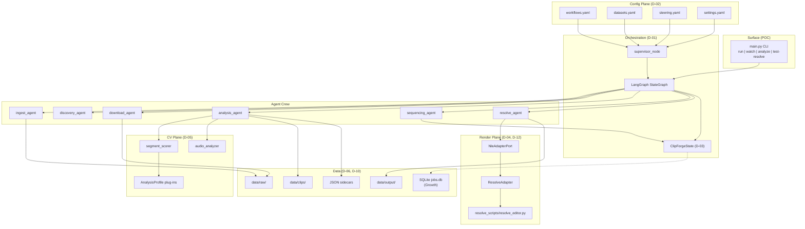
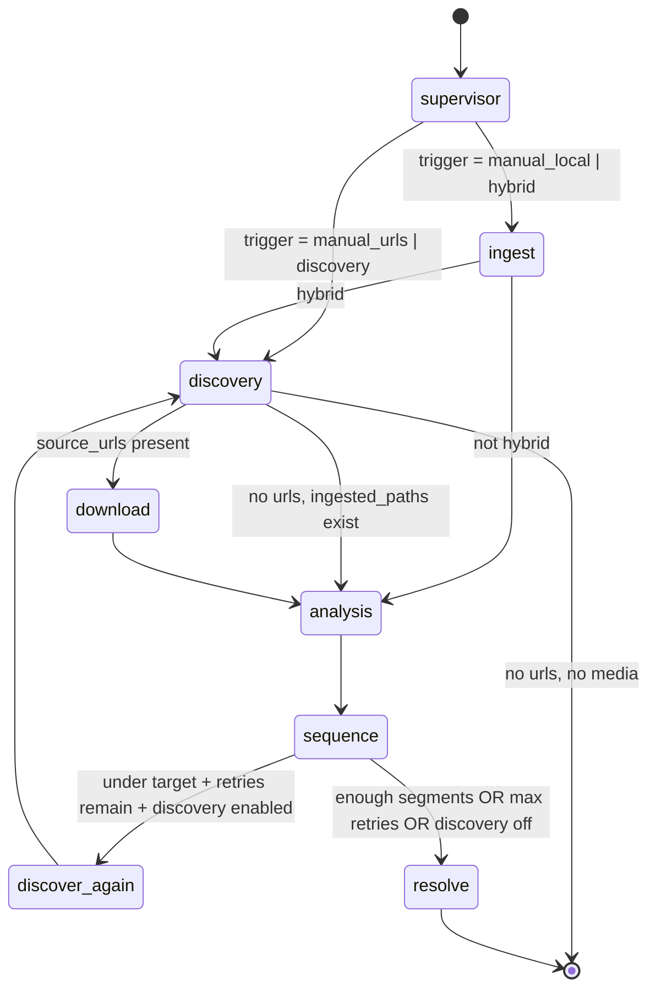

---
stepsCompleted:
  - step-01-init
  - step-02-context
  - step-03-starter
  - step-04-decisions
  - step-05-patterns
  - step-06-structure
  - step-07-validation
  - step-08-complete
inputDocuments:
  - clipforge/prd.md
  - clipforge/docs/ARCHITECTURE.md
  - clipforge/README.md
  - clipforge/config/workflows.yaml
  - clipforge/config/datasets.yaml
  - clipforge/config/settings.yaml
  - clipforge/config/steering.example.yaml
workflowType: architecture
project_name: ClipForge
user_name: Onimurasame
date: '2026-05-26'
lastStep: step-08-complete
status: complete
completedAt: '2026-05-26'
---

# Architecture Decision Document — ClipForge

_Normative technical design for the editor-simulation platform. Implementation agents SHALL treat this document as authoritative over `docs/ARCHITECTURE.md` (orientation only)._

## Project Context

### Requirements Overview

**Functional requirements:** The PRD defines **57 POC/Growth functional requirements** (CF-FR-01–45) plus **12 Vision requirements** (CF-FR-G1–G12). P0 (Editor Simulation Loop) concentrates on:

| Domain | Key FRs | Architectural implication |
|--------|---------|---------------------------|
| **Job orchestration** | CF-FR-01–06 | LangGraph `StateGraph`; unique `job_id`; dry-run flag |
| **Configuration** | CF-FR-07–16 | YAML config plane; steering merge over workflow defaults |
| **Triggers & acquisition** | CF-FR-17–23 | Trigger mode router in supervisor; yt-dlp download path |
| **Analysis & selection** | CF-FR-24–29 | Pluggable CV profiles; JSON sidecars; clip extraction Growth |
| **Sequencing & timeline** | CF-FR-30–33 | `sequencing_agent` respects `edit_style` from workflow |
| **Render & output** | CF-FR-34–37 | Resolve subprocess POC; `NleAdapterPort` Vision |
| **Compliance & ops** | CF-FR-38–41 | Fail-closed on zero media; discovery opt-in |
| **Growth** | CF-FR-42–45 | SQLite job store; review CLI; LangChain discovery tools |

**Non-functional requirements:** **22 NFRs** drive hard choices:

| Category | POC-critical NFRs | Architecture driver |
|----------|-------------------|---------------------|
| **Performance** | CF-NFR-P1 (≥2 FPS sampling) | OpenCV frame sampling at `sample_fps`; heuristic profiles |
| **Reliability** | CF-NFR-R1 (dry-run completes), CF-NFR-R2 (watch 3 cycles) | LangGraph conditional edges; no unhandled node exceptions |
| **Security** | CF-NFR-S1–S3 | Secrets via env; no inbound network; discovery off by default |
| **Observability** | CF-NFR-O1 (stderr stage errors) | `errors[]` + `messages[]` in `ClipForgeState` |
| **Maintainability** | CF-NFR-M1–M2 | New workflow = YAML row; new profile = CV plug-in |
| **Integration** | CF-NFR-I1–I2 | Resolve API 19+; yt-dlp pinned in requirements |

### Technical Constraints & Dependencies

| Constraint | Source | Impact |
|------------|--------|--------|
| **Configuration over code** | PRD | No genre/niche logic in core agents |
| **Local-first POC** | PRD + domain | All rushes, clips, outputs on operator disk |
| **Resolve quality authority** | PRD | NLE renders final pixels; ClipForge produces timeline plan |
| **CLI-only MVP surface** | PRD | No REST/Web UI until Vision |
| **Clip extraction gap** | Brownfield scaffold | `clip_path` null in POC; MoviePy Growth (G6) |
| **Discovery stub** | POC scope | Seed URLs + queries; LangChain tools Growth |
| **Python 3.11+** | README | LangGraph, OpenCV, Librosa stack |

### Cross-Cutting Concerns

1. **Config merge order** — `settings.yaml` → workflow defaults → steering overrides
2. **Job lineage** — `job_id` + steering hash; SQLite persistence Growth
3. **Rights-safe acquisition** — discovery disabled unless steering enables
4. **Stateful retry loop** — hybrid/discovery re-enter graph when timeline under target
5. **Sidecar artifacts** — segment JSON per source file for audit and review
6. **Dry-run semantics** — graph executes; Resolve and destructive writes skipped
7. **Agent isolation** — nodes mutate `ClipForgeState` only; no cross-import side effects
8. **NLE adapter boundary** — render plane behind port; Resolve is first adapter

### Scale & Complexity

| Dimension | POC (P0) | Growth (P1–P2) | Vision (P3–P4) |
|-----------|----------|------------------|----------------|
| Runtime | Single workstation | Same + SQLite | Optional cloud GPU workers |
| Orchestration | LangGraph linear+branch graph | + job recovery | + worker pool, fleet |
| CV | Heuristic OpenCV profiles | ONNX/custom profiles | Learning loop from renders |
| NLE | Resolve only | Resolve + clip extraction | Multi-NLE via port |
| Surface | CLI | CLI + review commands | Web UI + marketplace |

---

## Architecture Decision Records

| ID | Decision | Rationale | Phase |
|----|----------|-----------|-------|
| **D-01** | **LangGraph `StateGraph`** is the sole job orchestrator; graph compiled in `agents/orchestrator.py` | Stateful retries, conditional routing, agent observability; aligns with PRD CF-FR-02 | POC |
| **D-02** | **YAML config plane** — `workflows.yaml`, `datasets.yaml`, `steering.*.yaml`, `settings.yaml` — drives all behavior | Configuration is the product; CF-FR-07–16, CF-NFR-M1 | POC |
| **D-03** | **`ClipForgeState` TypedDict** (`lib/state.py`) is the canonical job schema; LangGraph `add_messages` for supervisor log | Single source of truth per job; typed agent contracts | POC |
| **D-04** | **DaVinci Resolve** is the sole NLE backend for POC via subprocess to `resolve_scripts/resolve_editor.py` | Professional finish authority; CF-NFR-I1; G3/G6 gates | POC |
| **D-05** | **Heuristic CV profiles** (`intensity_peaks`, `scene_change`) in `cv/segment_scorer.py` for POC; profile id from workflow | Meets CF-NFR-P1 without model training; plug-in contract Growth | POC |
| **D-06** | **File-based artifacts** for POC — segment sidecars as JSON under `data/clips/`; **SQLite** (`data/jobs.db`) for job records Growth | Local-first audit; CF-FR-27 POC, CF-FR-42 Growth | POC → Growth |
| **D-07** | **CLI-only surface** — `main.py` commands: `run`, `watch`, `analyze`, `test-resolve` | PRD MVP surface; no inbound network CF-NFR-S2 | POC |
| **D-08** | **yt-dlp** for remote download; **discovery stub** (seed URLs + steering queries) POC; **LangChain tools** for web search Growth | CF-FR-20–21; full discovery CF-FR-45 deferred | POC → Growth |
| **D-09** | **MoviePy (or FFmpeg)** segment extraction populates `clip_path` before resolve — not in POC | Resolve requires on-disk clips; G6 Growth gate | Growth |
| **D-10** | **Local data hierarchy** under `settings.yaml` paths: `raw`, `clips_qualified`, `clips_rejected`, `output`, `datasets` | Operator-owned media residency; domain local-first | POC |
| **D-11** | **Supervisor observability** via `messages[]` in state POC; **structured JSON logs** per agent transition Growth | CF-FR-06, CF-NFR-O1/O2 | POC → Growth |
| **D-12** | **`NleAdapterPort`** abstracts NLE handoff; Resolve adapter first; Premiere/FCP adapters Vision | CF-FR-G6 multi-NLE; no core fork per NLE | Growth → Vision |

### Decision Priority

**Critical (block POC gates G1–G5):** D-01, D-02, D-03, D-04, D-05, D-07, D-10

**Important (Growth G6+):** D-06 (SQLite), D-08 (LangChain discovery), D-09 (clip extraction), D-11 (structured logs)

**Deferred (Vision):** D-12 multi-NLE; LLM steering interpreter; web UI; worker pool

---

## Component Diagram



---

## LangGraph State Machine

Normative graph definition: `agents/orchestrator.py`. Entry point: `supervisor`. Terminal: `END` after `resolve` or early exit when no media.



### Routing rules (normative)

| Edge function | Condition | Target |
|---------------|-----------|--------|
| `_route_after_supervisor` | `discovery`, `manual_urls` | `discovery` |
| `_route_after_supervisor` | `hybrid`, `manual_local` | `ingest` |
| `_after_ingest_hybrid` | `trigger_mode == hybrid` | `discovery` |
| `_after_ingest_hybrid` | else | `analysis` |
| `_after_discovery` | `source_urls` or `dry_run` | `download` |
| `_after_discovery` | no urls, has `ingested_paths` | `analysis` |
| `_after_discovery` | no urls, no paths | `END` |
| `_need_more_segments` | plan short + retries + discovery on | `discover_again` |
| `_need_more_segments` | else | `resolve` |

### State fields (normative subset)

| Field | Set by | Consumed by |
|-------|--------|-------------|
| `job_id`, `workflow_id`, `dataset_ids`, `steering`, `trigger_mode` | `build_initial_state` | all nodes |
| `ingested_paths`, `source_urls` | ingest, discovery | download, analysis |
| `segment_candidates`, `timeline_plan` | analysis, sequence | sequence, resolve |
| `min_segment_score`, `target_duration_minutes` | steering merge | analysis, sequence |
| `discovery_retries`, `_discovery_max_retries` | discover_again, settings | `_need_more_segments` |
| `output_path`, `report`, `errors` | resolve, any | CLI exit code |
| `dry_run` | CLI flag | resolve, discovery |
| `messages` | supervisor, agents | observability |

---

## Config Plane

All runtime behavior SHALL be derivable from four YAML sources plus environment secrets.

### Merge order

```
settings.yaml (global defaults)
  → workflow row from workflows.yaml (by workflow_id)
    → steering file (per-job overrides)
      → CLI flags (--target-minutes, --min-score) — highest precedence
```

Implementation: `lib/config.py`, `lib/steering.py`, `agents/supervisor.build_initial_state`.

### File contracts

| File | Schema owner | Required keys (normative) |
|------|--------------|---------------------------|
| `config/workflows.yaml` | Platform | `id`, `edit_style`, `analysis_profile`, `defaults` |
| `config/datasets.yaml` | Operator | `id`, `local_paths` or `manifest`, optional `seed_urls`, `discovery_queries` |
| `config/steering.example.yaml` | Operator (copy per job) | `directives`, `discovery`, `ranking_weights` |
| `config/settings.yaml` | Platform | `paths`, `pipeline`, `analysis`, `resolve`, `triggers` |

### Workflow types (minimum)

| `id` | `edit_style` | `analysis_profile` | Sequencing behavior |
|------|--------------|--------------------|---------------------|
| `compilation_dense` | `compilation` | `intensity_peaks` | Dedupe overlaps; tight pacing |
| `highlight_reel` | `highlights` | `intensity_peaks` | Top scores; crossfade |
| `narrative_arc` | `narrative` | `scene_change` | Metadata order preserved |

Adding a workflow SHALL require only a new YAML row (D-02, CF-NFR-M1).

### Trigger modes

| Mode | Entry routing | Acquisition |
|------|---------------|-------------|
| `manual_local` | ingest → analysis | Local globs only |
| `manual_urls` | discovery → download | Explicit URLs |
| `discovery` | discovery → download | Seeds + queries (stub POC) |
| `hybrid` | ingest → discovery → … | Local first; retry loop |
| `scheduled` | Same as configured trigger | `clipforge watch` interval |

---

## Agent Boundaries

Each agent is a **pure LangGraph node**: `(ClipForgeState) → ClipForgeState`. Agents SHALL NOT call each other directly.

| Agent | Module | Inputs (state keys) | Outputs (state keys) | Side effects |
|-------|--------|---------------------|----------------------|--------------|
| **supervisor** | `agents/supervisor.py`, `orchestrator.py` | job config | `messages` | none |
| **ingest** | `agents/ingest_agent.py` | `dataset_ids`, steering | `ingested_paths`, `local_media_paths` | read filesystem |
| **discovery** | `agents/discovery_agent.py` | steering.discovery, datasets | `source_urls` | none (stub POC) |
| **download** | `agents/download_agent.py` | `source_urls` | `ingested_paths` | yt-dlp → `data/raw/` |
| **analysis** | `agents/analysis_agent.py` | `ingested_paths`, workflow profile | `segment_candidates` | JSON sidecars → `data/clips/` |
| **sequence** | `agents/sequencing_agent.py` | `segment_candidates`, `edit_style` | `timeline_plan` | none |
| **resolve** | `agents/resolve_agent.py` | `timeline_plan`, dry_run | `output_path`, `report`, `errors` | Resolve subprocess → `data/output/` |

### Agent rules (normative)

1. Agents SHALL append to `errors[]` rather than raise uncaught exceptions (CF-NFR-R1).
2. Agents SHALL NOT embed content-domain logic (CF-FR-39).
3. Agents SHALL read analysis profile id from merged workflow config, not hardcode (D-05).
4. `resolve_agent` SHALL fail with actionable message when `clip_path` missing (POC gap documented).
5. Growth: `analysis_agent` SHALL populate `clip_path` via extraction step before resolve (D-09).

---

## CV Plug-in Contract

Normative module: `cv/segment_scorer.py`. Audio fusion: `cv/audio_analyzer.py` via `analysis_agent`.

### Profile registration

Profiles are selected by `workflow.analysis_profile` string. POC ships:

| Profile id | Algorithm | Use case |
|------------|-----------|----------|
| `intensity_peaks` | Motion delta + visual intensity (OpenCV) | Compilation, highlights |
| `scene_change` | Frame difference proxy | Narrative arc |

Growth: register additional profiles in `cv/profiles/` without modifying `analysis_agent` core.

### Scorer function signature (normative)

```python
def score_segments(
    video_path: Path,
    *,
    profile: str = "intensity_peaks",
    min_score: float = 0.75,
    clip_min_sec: int = 3,
    clip_max_sec: int = 15,
    motion_threshold: float = 0.12,
    visual_threshold: float = 0.7,
    sample_fps: float = 2.0,
    ranking_weights: dict[str, float] | None = None,
) -> list[dict[str, Any]]:
    ...
```

### Segment record schema (normative)

Each returned segment dict SHALL include:

| Key | Type | Required | Notes |
|-----|------|----------|-------|
| `source` | str | yes | Absolute path to source media |
| `profile` | str | yes | Profile id used |
| `start_sec`, `end_sec`, `duration_sec` | float | yes | Time range in source |
| `motion_score`, `visual_score`, `segment_score` | float | yes | Combined score after audio merge in agent |
| `clip_path` | str \| null | yes | null POC; populated Growth (D-09) |

### Audio analyzer contract

```python
def analyze_audio_emphasis(
    video_path: Path,
    start_sec: float,
    end_sec: float,
    *,
    peak_db_threshold: float = -12.0,
) -> float:
    """Returns 0.0–1.0 emphasis score for segment window."""
```

`analysis_agent` SHALL combine visual and audio scores using `steering.ranking_weights` (CF-FR-26).

### Adding a profile (Growth)

1. Implement scorer callable matching signature above.
2. Register in profile registry keyed by string id.
3. Reference id in new workflow YAML row.
4. No changes to LangGraph topology (CF-NFR-M2).

---

## NLE Adapter Port

Normative interface for render plane (D-12). POC uses `ResolveAdapter` only; Vision adds adapters behind same port.

```python
from dataclasses import dataclass
from pathlib import Path
from typing import Protocol


@dataclass
class RenderSettings:
    output_dir: Path
    project_name: str
    timeline_name: str
    render_format: str  # mp4
    render_codec: str     # H.264


@dataclass
class TimelineClip:
    clip_path: Path
    start_sec: float | None  # in-source trim (optional)
    end_sec: float | None
    transition: str          # cut | crossfade | dissolve


class NleAdapterPort(Protocol):
    def is_available(self) -> bool:
        """Return False if NLE scripting runtime not installed."""
        ...

    def create_project(self, settings: RenderSettings) -> str:
        """Create or open project; return project_id/handle."""
        ...

    def append_clips(self, project_id: str, clips: list[TimelineClip]) -> None:
        """Build timeline from ordered clips."""
        ...

    def render(self, project_id: str, output_path: Path) -> Path:
        """Execute render job; return final output path."""
        ...

    def setup_guide(self) -> str:
        """Actionable operator instructions when is_available() is False."""
        ...
```

### Adapters

| Adapter | Phase | Implementation |
|---------|-------|----------------|
| `ResolveAdapter` | POC | Subprocess → `resolve_scripts/resolve_editor.py`; Resolve API 19+ |
| `ResolveAdapter` (in-process) | Growth | Optional: import Resolve scripting module directly |
| `PremiereAdapter` | Vision | Adobe ExtendScript / UXP behind port |
| `FinalCutAdapter` | Vision | FCPXML export + bundle trigger |

### POC resolve flow (normative)

1. `resolve_node` loads `settings.resolve` render config.
2. If `dry_run`: emit fake output path; skip subprocess.
3. Collect `clip_path` from each `timeline_plan` item.
4. If any missing: append error with MoviePy setup guidance (CF-FR-37).
5. Invoke `resolve_editor.py --clips … --output-dir … --project-name …`.
6. Set `output_path` to newest MP4 in output dir.

---

## Data Paths

Canonical paths from `config/settings.yaml` (D-10). All paths relative to `clipforge/` package root unless absolute.

| Key | Default | Contents | Writer | Reader |
|-----|---------|----------|--------|--------|
| `paths.raw` | `data/raw` | Ingested rushes, downloads | ingest, download | analysis |
| `paths.clips_qualified` | `data/clips/qualified` | Extracted segment files (Growth) | extraction step | resolve |
| `paths.clips_rejected` | `data/clips/rejected` | Below-threshold segments (Growth review) | analysis | review CLI |
| `paths.output` | `data/output` | Rendered masters | resolve | operator |
| `paths.datasets` | `data/datasets` | Manifest JSONL (Growth) | operator | ingest |
| `paths.sqlite` | `data/jobs.db` | Job records (Growth) | job store | `jobs` CLI |

### Sidecar layout (POC)

```
data/clips/
  {source_basename}.segments.json   # list of segment dicts per source file
```

Sidecars SHALL be written by `analysis_agent` after scoring (CF-FR-27).

### Job artifact layout (Growth)

```
data/jobs/
  {job_id}/
    steering.snapshot.yaml
    timeline_plan.json
    report.json
```

SQLite schema (Growth, minimal):

| Table | Columns |
|-------|---------|
| `jobs` | `id`, `status`, `workflow_id`, `created_at`, `steering_hash`, `output_path` |
| `job_segments` | `job_id`, `segment_id`, `approved`, `segment_json` |
| `audit_log` | `job_id`, `ts`, `stage`, `detail` |

---

## POC vs Growth Boundaries

| Capability | POC (P0) | Growth (P1–P2) | Vision (P3–P4) |
|------------|----------|----------------|----------------|
| **Orchestrator** | LangGraph full graph | + job recovery from SQLite | Worker pool, concurrent jobs |
| **Surface** | CLI | CLI + `jobs list/inspect/approve` | FastAPI + Gradio web UI |
| **Config** | YAML files | + manifest datasets JSONL | LLM populates steering from NL brief |
| **CV** | Heuristic OpenCV | ONNX/custom profiles | Learning loop from renders |
| **Clip extraction** | Not implemented (`clip_path` null) | MoviePy/FFmpeg (G6) | Same |
| **Discovery** | Stub (seeds/queries) | LangChain search tools | Budget caps, always-on |
| **NLE** | Resolve subprocess | Resolve in-process option | Multi-NLE via `NleAdapterPort` |
| **Persistence** | JSON sidecars | SQLite job store | Shared dataset registry |
| **Observability** | stderr + `messages[]` | Structured JSON logs | Fleet dashboard |
| **Human review** | CLI logs only | Approve/reject segments CLI | Approval gate before render |
| **Network** | Outbound only (yt-dlp) | Same + discovery API | Optional cloud GPU workers |

### POC acceptance gates — architectural support

| Gate | Requirement | Supporting decisions |
|------|-------------|-------------------|
| **G1** | `run --dry-run` completes | D-01, D-03, D-07; dry_run routing |
| **G2** | `analyze` returns scored segments | D-05, CV contract |
| **G3** | Local job → timeline_plan + sidecars | D-02, D-10, agent boundaries |
| **G4** | Steering overrides workflow | Config merge order |
| **G5** | `watch --dry-run` ≥3 cycles | D-01, D-07; scheduled trigger |
| **G6** | Real Resolve render (Growth) | D-09, D-04, NLE port |

### Explicitly out of scope (POC)

Web UI, REST API, multi-tenant SaaS, agent marketplace, cloud GPU fabric, multi-NLE, LLM steering execution, automatic publishing, full web discovery.

---

## FR → Component Traceability

| FR domain | FR IDs | Runtime location |
|-----------|--------|------------------|
| Job orchestration | CF-FR-01–06 | `main.py`, `agents/orchestrator.py`, `lib/state.py` |
| Workflows | CF-FR-07–09 | `config/workflows.yaml`, `lib/config.py` |
| Datasets | CF-FR-10–13 | `config/datasets.yaml`, `agents/ingest_agent.py` |
| Steering | CF-FR-14–16 | `config/steering.*.yaml`, `lib/steering.py` |
| Triggers & acquisition | CF-FR-17–23 | `triggers/`, `agents/discovery_agent.py`, `agents/download_agent.py`, `main.py watch` |
| Analysis & selection | CF-FR-24–29 | `agents/analysis_agent.py`, `cv/segment_scorer.py`, `cv/audio_analyzer.py` |
| Sequencing & timeline | CF-FR-30–33 | `agents/sequencing_agent.py` |
| Render & output | CF-FR-34–37 | `agents/resolve_agent.py`, `resolve_scripts/`, `NleAdapterPort` |
| Compliance & ops | CF-FR-38–41 | All agents (fail-closed), `README.md` rights notice |
| Growth jobs | CF-FR-42–45 | `data/jobs.db` (TBD module), discovery LangChain tools |
| Vision NL steering | CF-FR-G1 | LLM agent (TBD) → steering YAML |
| Vision approval | CF-FR-G2 | Gate node before resolve in graph extension |
| Vision fleet | CF-FR-G3–G4 | Worker queue + shared config registry |
| Vision marketplace | CF-FR-G5, CF-FR-G8 | Pack installer for workflows + CV profiles |
| Vision multi-NLE | CF-FR-G6–G7 | `NleAdapterPort` implementations |
| Vision UI | CF-FR-G9 | FastAPI + Gradio (deferred) |
| Vision ops | CF-FR-G10–G12 | Budget middleware, RBAC, KPI telemetry |

---

## Architecture Validation

### Coherence

| Check | Status |
|-------|--------|
| PRD POC gates G1–G5 ↔ LangGraph + CLI | Pass |
| `docs/ARCHITECTURE.md` graph ↔ `orchestrator.py` | Pass — normative source is this document + code |
| Config-over-code mandate ↔ agent boundaries | Pass — no domain logic in agents |
| Resolve POC ↔ NLE port forward-compatible | Pass — D-12 wraps existing subprocess |
| Brownfield scaffold ↔ decision records | Pass — aligns with existing modules |

### Open Items (non-blocking POC)

| Item | Owner | When |
|------|-------|------|
| MoviePy clip extraction wiring | Growth sprint | G6 |
| SQLite job store module | Growth sprint | CF-FR-42 |
| LangChain discovery tools | Growth sprint | CF-FR-45 |
| Profile registry module extraction | Growth sprint | CF-NFR-M2 |
| LLM steering interpreter | P2 Growth | CF-FR-G1 |

---

## Implementation Handoff

**Status:** Complete — normative architecture for ClipForge POC sprint.

**Implementation tree:**

```
clipforge/
  architecture.md          # this document (normative)
  prd.md
  docs/ARCHITECTURE.md     # orientation only
  main.py                  # CLI entry
  agents/                  # LangGraph nodes
  cv/                      # segment_scorer, audio_analyzer, profiles/
  lib/                     # state, config, steering
  triggers/                # TriggerMode enum
  resolve_scripts/         # ResolveAdapter subprocess
  config/                  # YAML config plane
  data/                    # operator media (gitignored)
  tests/                   # test_graph, test_config
```

**Agent read order:** Frontmatter → Decision Records D-01–D-12 → LangGraph State Machine → Agent Boundaries → CV Contract → NLE Port → FR traceability.
