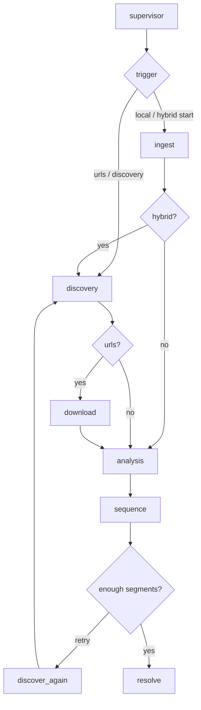

# ClipForge architecture — editor simulation

ClipForge does not encode a content niche or edit style in code. It simulates how a human editor works: ingest footage, interpret a creative brief, select moments, assemble a timeline, and render — driven entirely by **datasets**, **workflows**, and **steering**.

## Core concepts

| Concept | Role |
|---------|------|
| **Dataset** | A corpus of source media: local paths, manifests, seed URLs, or discovery queries (`config/datasets.yaml`). |
| **Workflow** | An editing style template: pacing, transitions, segment length, analysis profile (`config/workflows.yaml`). |
| **Steering** | Per-job editor directives: natural-language brief, scores, ranking weights, discovery knobs (`config/steering.example.yaml`). |
| **Trigger** | How the job starts and acquires media: manual local, URLs, discovery, hybrid, scheduled (`triggers/`). |
| **Agent crew** | LangGraph nodes that mirror editor roles: ingest, discover, download, analyze, sequence, resolve. |

## Human editor mapping

```
Human editor              ClipForge agent
─────────────────────────────────────────
Log / label footage   →   ingest_agent (datasets)
Find new sources      →   discovery_agent (+ watch loop)
Pull remote rushes    →   download_agent
Review selects        →   analysis_agent (segment_scorer + audio)
Build rough cut       →   sequencing_agent (timeline_plan)
Online in NLE         →   resolve_agent (DaVinci Resolve API)
Producer notes        →   steering.directives.natural_language (LLM Phase 2)
```

## Trigger modes

1. **manual_local** — Operator drops files into `data/raw/inbox/`; pipeline ingests only.
2. **manual_urls** — Explicit URLs in CLI or steering; discovery → download.
3. **discovery** — Automated search/feeds (stub: seeds + queries; LangChain tools Phase 2).
4. **hybrid** — Local dataset plus ongoing discovery (retry loop when timeline is short).
5. **scheduled** — Same as above, invoked on a cadence (`clipforge watch` or system cron).

## Pipeline graph



## Extensibility (no fork required)

- **New genre or subject matter:** Add datasets + steering brief; optionally swap analysis models.
- **New edit style:** Add a workflow row; sequencing respects `edit_style`.
- **New acquisition:** Plug tools into `discovery_agent`; enable `discovery.enabled` in steering.
- **Always-on automation:** `clipforge watch` with `trigger: discovery`.

## Out of scope (POC)

- Web UI, billing, cloud workers
- Full LLM shot selection (steering NL is stored; tools Phase 2)
- Automatic clip file extraction to disk (Resolve needs `clip_path`; MoviePy Phase 2)
