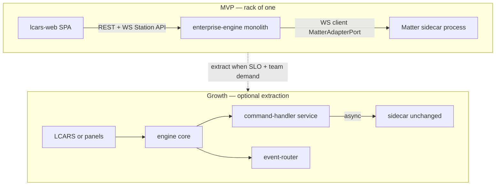

# Engine Technical Architecture — ENTERPRISE Main Computer

**Status:** Normative for `enterprise/platform/` implementation  
**Audience:** Engineering crew (Picard chair), implementers, OpenSpec authors  
**Supersedes:** Ad-hoc file layout only — extends [architecture.md](../architecture.md) (D-01) with **how each element is built**  
**UX:** Frozen at charter level — LCARS consumes this engine via Station API only (`enterprise/ux/`)

---

## 1. Architectural stance (MVP vs growth)

### What we are building now

| Pattern | MVP choice | Rationale |
|---------|------------|-----------|
| **Deployment** | **Modular monolith** + **one external process** (Matter sidecar) | Solo-builder rack-of-one; lowest ops burden; matches Docker Compose |
| **Microservices** | **Logical boundaries only** — not separate deployables per domain | Avoid distributed-system tax before G3 dogfood |
| **Serverless / Lambda** | **Not MVP** — handlers written **lambda-shaped** for future extraction | Same TypeScript modules; no AWS coupling in core |
| **Hexagonal (ports & adapters)** | **Yes** — normative | `MatterAdapterPort`, swappable adapters, testability |
| **Event-driven** | **Yes** — in-process bus → WebSocket fan-out | NFR-P2/P3; LCARS is a subscriber |
| **CQRS-lite** | **Yes** | Commands via POST; reads from adapter-backed snapshot + `freshnessTs` |
| **DDD bounded contexts** | **Four contexts** (below) | Clear ownership; no shared mutable globals across contexts |

### Growth path (deterministic evolution)



**Rule:** No Growth extraction until **OpenSpec requirement + ADR** exists. MVP code MUST still follow handler boundaries below so extraction is a **move**, not a rewrite.

---

## 2. Runtime topology (deployment units)

| Unit | Process | Technology | Owns truth for |
|------|---------|------------|----------------|
| **U1 — Orchestration engine** | `enterprise-engine` | Node 24, Fastify | Alert FSM, conflict policy, clearance, audit, read-model orchestration |
| **U2 — Matter sidecar** | `matter-server` | python-matter-server (Docker) | Fabric credentials, Matter node membership, CASE/ACL |
| **U3 — LCARS** | `lcars-web` (separate workspace) | Vite/React | **No truth** — projection only |
| **U4 — Sim bridge** | `sim-bridge` (optional) | Node | Spatial sim only — not production path |

**ADR alignment:** ADR-MA-01 (sidecar isolation), ADR-MA-04 (LCARS → engine only), ADR-MA-05 (FSM in engine).

---

## 3. Bounded contexts (domain boundaries)

Each context has **one write model owner**. Cross-context communication uses **integration events** (facts derived from domain logic) — no direct mutation across another context’s internals.

**Two-layer event model (do not conflate):**

| Layer | What | Where | Package |
|-------|------|-------|---------|
| **Domain event** | Semantic fact in ubiquitous language (e.g. phase changed, conflict detected) | `domain/` or returned from application services | **No** `@enterprise/*` imports in `domain/` |
| **Integration envelope** | Wire/stream container for LCARS and future bridge-station | `application/` or `api/` before `broadcast()` | `@enterprise/event-envelope` (`EventEnvelopeV1`, `createEventEnvelope`) |

Cross-context delivery **on the wire** is always `EventEnvelopeV1`. **Domain code MUST NOT** import or construct envelopes — that is an application/API boundary concern (today: `api/routes.ts`).

| Context | ID | Responsibility | OpenSpec home |
|---------|-----|----------------|---------------|
| **Station & Matter** | `ctx.station` | Adapter lifecycle, snapshots, attribute paths, commissioning | `matter-adapter`, `station-api` |
| **Command & outcome** | `ctx.command` | Setpoint/commands, TNG outcomes, receipts, clearance gate | `tng-outcomes`, `lcars-environmental`, `lcars-security` |
| **Alert & posture** | `ctx.alert` | Alert FSM (XState), transitions, Battle Stations gate | `alert-fsm`, `lcars-security` |
| **Conflict & coexistence** | `ctx.conflict` | Dual-writer detection, reconcile, hybrid honesty | `lcars-conflict`, ART-02/03 |

```text
┌─────────────────────────────────────────────────────────┐
│                    U1: engine process                    │
│  ┌─────────────┐  ┌─────────────┐  ┌─────────────────┐ │
│  │ ctx.station │→ │ ctx.conflict│→ │ ctx.command     │ │
│  │ (adapter)   │  │             │  │ (outcomes)      │ │
│  └──────┬──────┘  └─────────────┘  └────────┬────────┘ │
│         │ events                           │           │
│         └──────────────┬─────────────────────┘           │
│                        ▼                                 │
│                 ┌─────────────┐                          │
│                 │ ctx.alert   │                          │
│                 │ (FSM)       │                          │
│                 └──────┬──────┘                          │
│                        │ broadcast EventEnvelopeV1        │
└────────────────────────┼────────────────────────────────┘
                         ▼
                  WS /api/v1/events/stream
                         ▼
                    LCARS (U3)
```

---

## 4. Layered structure (hexagonal)

### 4.1 Package layer (shared kernels)

| Package | Path | Layer | Contents |
|---------|------|-------|----------|
| `@enterprise/matter-port` | `runtime/packages/matter-port` | **Port** | `MatterAdapterPort`, `StationSnapshot`, `MatterNodeEvent`, `CommandReceipt` |
| `@enterprise/event-envelope` | `runtime/packages/event-envelope` | **Contract** | `EventEnvelopeV1`, `createEventEnvelope`, schema v1 |
| `@enterprise/tng-outcomes` | `runtime/packages/tng-outcomes` | **Contract** | `OutcomeType`, `createOutcome`, denial messages |

**Rule:** Packages are **pure types + pure functions** — no Fastify, no SQLite, no WebSocket. CI builds packages before `engine`.

### 4.2 Engine interior (target layout)

Current code is close; **target** layout for deterministic agent work:

```text
engine/src/
  index.ts                 # composition root (DI wiring only)
  config/                  # env, feature flags, security toggles
  api/                     # driving adapters (HTTP/WS)
    routes.ts              # thin: parse → application service → respond
    schemas/               # (growth) JSON Schema / Zod per route
  application/             # use cases (orchestration, no Fastify types)
    station-service.ts
    command-service.ts
    alert-service.ts
    conflict-service.ts
  domain/                  # pure domain logic
    alert-fsm.ts             # XState machine definition
    conflict-tracker.ts
    policies/                # clearance + battle stations rules
  ports/                   # driven port interfaces (engine-local)
    persistence-store.ts     # alias re-export of store-types
  adapters/                # driven adapters
    mock-matter-adapter.ts
    ohf-sidecar-adapter.ts
    sim-matter-adapter.ts
    create-adapter.ts
  persistence/             # SQLite / memory implementations
    db.ts
    memory-alert-store.ts
    store-types.ts
  middleware/
    clearance.ts
```

**Current state:** `api/routes.ts` contains application logic — **acceptable for sprint 2**; refactor into `application/*` when touching a use case (strangler fig).

### 4.3 Dependency rule (enforced by convention + lint)

| From → To | Allowed |
|-----------|---------|
| `api` → `application` → `domain` | Yes |
| `application` → `ports`, `@enterprise/matter-port`, `@enterprise/event-envelope`, `@enterprise/tng-outcomes` | Yes |
| `api` → `@enterprise/event-envelope` (wrap + broadcast) | Yes — **integration boundary** |
| `domain` → `adapters`, `api`, Fastify, **any** `@enterprise/*` | **No** |
| `domain` → `application` | **No** (domain is innermost) |
| `packages/*` → `engine` | **No** (shared kernels are leaf dependencies) |
| `lcars-web` → `engine` HTTP/WS only | Yes (ADR-MA-04) |
| `engine` → `lcars-web` | **No** |

**Invariant:** `EventEnvelopeV1` is a **transport contract**, not a domain entity. `DomainEventType` in `@enterprise/event-envelope` is the **stream discriminator** for routing/deserialization — adapters map domain facts to it at publish time; domain modules do not reference it.

---

## 5. Application services (implementation map)

Each service is a **cohesive module** with a single entry function per use case. This is the **lambda-shaped** boundary: `export async function handleX(cmd: XCommand): Promise<XResult>`.

### 5.1 `StationService`

| Use case | Trigger | Port / store | Emits |
|----------|---------|--------------|-------|
| `listStations` | `GET /api/v1/stations` | `MatterAdapterPort.getStations()` | — |
| `getStation` | `GET /api/v1/stations/:id` | adapter + registry upsert | — |
| `onMatterEvent` | adapter subscription | conflict tracker hint | `StationUpdated` |

**Implementation today:** `routes.ts` lines ~62–92, `adapter.subscribe`.

### 5.2 `CommandService`

| Use case | Trigger | Rules | Emits |
|----------|---------|-------|-------|
| `commandSetpoint` | `POST /api/v1/commands/setpoint` | clearance, conflict check, adapter write | outcome + `SetpointCommanded` |

**Outcome law:** Always `@enterprise/tng-outcomes` — HTTP status is secondary.

**Implementation today:** `routes.ts` setpoint handler.

### 5.3 `AlertService`

| Use case | Trigger | Rules | Emits |
|----------|---------|-------|-------|
| `getAlertSnapshot` | `GET /api/v1/alerts` | read FSM actor context | — |
| `escalate` | `POST /api/v1/alerts/escalate` | FSM transitions | `AlertPhaseChanged` |
| `battleStations` | `POST /api/v1/alerts/battle-stations` | **NFR-UX6** gate (`isBattleStationsGateEnabled`) | `AlertPhaseChanged` |

**Implementation today:** XState actor in `routes.ts`; persistence via `PersistenceStore`.

### 5.4 `ConflictService`

| Use case | Trigger | Emits |
|----------|---------|-------|
| `getConflict` | `GET /api/v1/system/conflict` | — |
| `reconcile` | `POST /api/v1/system/conflict/reconcile` | clears + event |

**Implementation today:** `ConflictTracker` in `domain/conflict-tracker.ts`.

---

## 6. Cross-cutting mechanisms

### 6.1 Event bus (in-process)

| Step | Layer | Mechanism |
|------|-------|-----------|
| 1 | `domain` / `application` | Use case completes; domain fact available (FSM transition, conflict state, station read-model change) |
| 2 | `application` or `api` | `createEventEnvelope(type, payload)` from `@enterprise/event-envelope` — **not** in `domain/` |
| 3 | composition root | `broadcast(envelope)` in `index.ts` fan-out to WS clients |
| 4 | (Growth) `persistence` | append to `audit_log` + outbox table |

**Determinism:** Envelope `type` strings (`DomainEventType`) are enumerated in OpenSpec `station-api` and must match `packages/event-envelope` exports. Domain logic uses its own types and names; the boundary assigns the envelope discriminator.

**Implementation today:** envelope creation in `engine/src/api/routes.ts` only — aligns with §4.3. When `application/*` services are extracted, they own step 2; `api/` stays thin (parse → service → wrap → respond).

### 6.2 Persistence

| Store | Interface | MVP impl | Contents |
|-------|-----------|----------|----------|
| Alert snapshot | `PersistenceStore` | SQLite or `MemoryAlertStore` | FSM phase, timestamps |
| Station registry | `AlertStore` methods | SQLite | stationId ↔ nodeId, authority |
| Audit | (growth) | append-only table | commands, denials, transitions |

**Env:** `ALERT_STORE=memory` for dev/CI without native SQLite build.

### 6.3 Security middleware

| Concern | Implementation |
|---------|----------------|
| Clearance header | `middleware/clearance.ts` — `x-clearance: Captain \| Crew \| Guest` |
| Route guards | `requireClearance('Crew')` on mutating routes |
| Battle Stations | `config/security.ts` — feature gate |

**Worf rule:** Policy is **code + OpenSpec**, not LCARS-only enforcement.

### 6.4 Matter adapter selection

| `MATTER_ADAPTER` | Class | When |
|------------------|-------|------|
| `mock` | `MockMatterAdapter` | Sprint 1, CI, local dev default |
| `ohf` | `OhfSidecarAdapter` | Live sidecar / W0 |
| `sim` | `SimMatterAdapter` | Digital twin bridge |

Factory: `adapters/create-adapter.ts` — **only** composition root may branch on env.

---

## 7. Station API surface (contract-first)

All routes **SHALL** match `openspec/specs/station-api/spec.md`. Implementation checklist:

| Method | Path | Handler owner | Spec tag |
|--------|------|---------------|----------|
| GET | `/health` | infra | ops |
| GET | `/api/v1/system/status` | StationService | diagnostics |
| GET | `/api/v1/stations` | StationService | FR-H3 |
| GET | `/api/v1/stations/:id` | StationService | environmental |
| GET | `/api/v1/alerts` | AlertService | alert FSM |
| POST | `/api/v1/commands/setpoint` | CommandService | W-CT-03 |
| POST | `/api/v1/alerts/escalate` | AlertService | ART-08 |
| POST | `/api/v1/alerts/battle-stations` | AlertService | NFR-UX6 |
| GET/POST | `/api/v1/system/conflict/*` | ConflictService | ART-02 |
| WS | `/api/v1/events/stream` | `index.ts` | envelope v1 |

**Versioning:** Breaking API changes require OpenSpec delta + `schemaVersion` bump — never silent drift.

---

## 8. Deterministic codebase rules

### 8.1 Source of truth order

1. MVP gates **G1–G5** ([prd.md](../prd.md))  
2. OpenSpec `openspec/specs/*` (WHEN/THEN)  
3. This document + [architecture.md](../architecture.md)  
4. Code (must conform or spec must change first)

### 8.2 Change workflow (engine)

```text
OpenSpec delta (if behavior changes)
    → update application/domain code
    → update/ add engine test (w-ct-*.test.ts)
    → npm test -w @enterprise/engine
    → (if HTTP contract) UX e2e still green — UX workspace
```

### 8.3 Testing layers

| Layer | Location | Proves |
|-------|----------|--------|
| Unit | `engine/test/*.test.ts` | FSM, outcomes, policy, mock adapter |
| Contract | W-CT-01–10 | Clearance, setpoint, conflict, freshness |
| Integration | `sim-matter.integration.test.ts` | Sim adapter + engine |
| Soak | ART-07 harness | WAN-down, 24h (G1) |

**No test shall depend on LCARS UI** — engine tests use `MockMatterAdapter` only.

### 8.4 CI commands (platform workspace)

```powershell
cd enterprise/platform/runtime
npm install
npm run build
npm test
npm run validate:openspec
```

---

## 9. Alignment gaps (honest — refactor backlog)

| Gap | Current | Target | Priority |
|-----|---------|--------|----------|
| Application layer | Logic in `api/routes.ts` | `application/*` services | P1 — next feature touch |
| `ports/` folder | Types in `persistence/store-types.ts` | Re-export + driven ports grouped | P2 |
| Audit append-only | Partial / implicit | `audit_log` table + middleware | P1 — Worf |
| OpenAPI / JSON Schema | Implicit Fastify | `api/schemas` generated or Zod | P2 |
| Outbox / idempotency keys | None | `receiptId` dedup on commands | P2 — before scale |
| Docs paths | Some `enterprise/runtime` refs | `enterprise/platform/runtime` | P0 — doc sweep |

---

## 10. What we are NOT doing (anti-patterns)

| Anti-pattern | Why rejected |
|--------------|--------------|
| LCARS calls Matter sidecar | Violates ADR-MA-04 |
| NestJS-style microservices for MVP | Ops cost; monolith modular is enough |
| Shared mutable singletons across contexts | Breaks testability and extraction |
| Bare HTTP errors to operators | Violates TNG outcome contract |
| Alert FSM authority in LCARS | Violates ADR-MA-05 |
| Per-request Matter reads for tiles | Violates CQRS-lite / NFR-P2 |

---

## 11. Related documents

| Doc | Role |
|-----|------|
| [architecture.md](../architecture.md) | D-01 decisions, MatterAdapterPort, Compose |
| [openspec/specs/](../openspec/specs/) | SHALL-level requirements |
| [openspec/gates.yaml](../openspec/gates.yaml) | G1–G5 verification map |
| [prd.md](../prd.md) | FR/NFR |
| [docs/artifacts/](../docs/artifacts/) | ART-01–08 |
| [AGENTS.md](../AGENTS.md) | Engineering crew charter |

---

**Council:** Geordi La Forge (structure), Data (contracts), Worf (security), Picard (synthesis) — engine focus; UX council not required for merges that touch only this tree.
