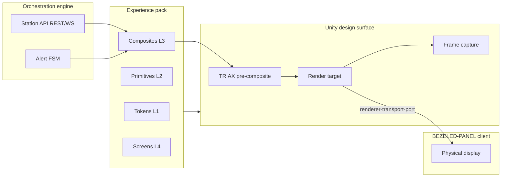

# Sim UX Specification — Unity/Unreal House Simulator & In-Wall LCARS Panels

**Companion to:** [UX Design Specification](./ux-design-specification.md)  
**Scope:** Unity/Unreal digital twin surfaces, in-wall BACKLIT-PLATE and BEZELED-PANEL render targets, and phased physical panel rollout  
**Status:** Draft — Okuda audit **PENDING**

---

## Executive Summary

Unity and Unreal are **shipwide LCARS renderer surfaces** governed by the same five-layer experience-pack contract as web LCARS — not a permanent debug harness. The digital twin proves spatial placement, distance-aware legibility, alert motion law, and Environmental truth-loop UX before physical in-wall panels ship.

**Sprint 1 proof:** One BACKLIT-PLATE at [central-hall](#panel-placement-ia) bound to `env.nest.thermostat.primary`, rendering `HealthStrip` against a live alert FSM in Unity. Production panels are **dumb 2D clients** over `renderer-transport-port`; Unity remains the **design surface** for layout, okudaAudit capture, and distance validation.

**Phased rollout:** Sprint 1 central-hall Environmental only → Phase 2 entry-hall Ops threshold (blocked until arrival verbs exist) → Phase 3 circulation wayfinding toward basement. Hall-to-master, living-room, and office panels are **deferred**.

**Charter conditions (Round 1):** Tokens and composites unchanged from parent spec; portability flags from commit one; MVP Environmental loop proven in sim before shipwide panel rollout; every installed panel hosts at least one operator verb — no decoration-only plates.

---

## North Star

The house is the vessel. Unity/Unreal visualize **where** LCARS lives on bulkheads; in-wall panels are **renderers** of the same Station API and experience pack as web LCARS and the future battle bridge console.

| Principle | Sim/panel implication |
|-----------|----------------------|
| **One organism** | Panel surfaces consume engine REST/WS — never sidecar or Matter directly |
| **Color is information** | TRIAX department identity composited upstream; no engine-shader TNG hardcoding |
| **Behavior before palette** | Alert FSM drives layout density, motion law, and decorative suspend before token swap |
| **Captain-not-passenger** | In-wall plates expose station verbs at clearance tier — Guest is read-only, not teased controls |
| **Okuda legibility** | Composites readable at **3 m** viewing distance on realized buffer |

**Default sim landing:** `ops.overview` parity optional in harness; **Sprint 1 installed panel** lands on `env.subsystem` scoped to Environmental station at central-hall anchor.

---

## Renderer Surfaces

All LCARS output channels are **renderer surfaces** under layer 5 (Renderer contract) of the parent five-layer stack:

| Surface | Role | Sprint |
|---------|------|--------|
| **Web LCARS** (`lcars-web`) | Primary operator console; reference renderer | 1 |
| **Unity harness** | Design surface, spatial preview, okudaAudit capture, distance validation | 1 |
| **Unreal harness** | Optional second engine; same Sim Bridge + renderer contract | Deferred |
| **BACKLIT-PLATE** | Planar in-wall render target; TRIAX pre-composited | 1 (sim + 1 physical) |
| **BEZELED-PANEL** | Production dumb 2D client; identical pixel contract to BACKLIT-PLATE | Phase 2+ |
| **Battle bridge wall display** | Large-format renderer; D-14 ≥1440px opt-in | Growth |

### Renderer transport model (C-SIM-12)

Production panels are **dumb 2D clients** — they receive finalized frame buffers or stream deltas via `renderer-transport-port`. They do **not** embed experience-pack logic, token parsing, or alert FSM ownership.

Unity is the **authoritative design surface** for:

- Panel placement against [layout anchors](./sim/layouts/onimurasame-residence-2026-05-24.json)
- Render-target resolution and aspect ratio
- 3 m legibility validation
- Pre-install okudaAudit on render target and captured frame



### Five renderer port gaps (C-SIM-06)

The following ports are **normative additions** to [architecture.md](./architecture.md) — sim UX depends on them; they are not optional for panel rollout:

| Port | Gap closed | Owner |
|------|------------|-------|
| **`RendererTransportPort`** | Frame push, heartbeat, reconnect for dumb 2D clients | Engine + panel firmware |
| **`RendererCapabilitiesDescriptorPort`** | Per-engine manifest: max resolution, color space, touch, audio | Sprint 1 deliverable |
| **`DistanceAwareCompositePort`** | Scale tokens/composites for `viewingDistanceM` (default 3) | Experience pack + renderer |
| **`PanelAttestationPort`** | Panel ID, clearance profile, NFR-UX6 gate reachability | Engine middleware |
| **`EngineParityCertificatePort`** | Chain `engine-parity.certificate.yaml` → parent visual freeze | CI / release |

---

## BACKLIT-PLATE Model

BACKLIT-PLATE and BEZELED-PANEL share one **pixel contract**. The only difference is physical bezel industrial design; UX, transport, and attestation are identical.

### Planar plate geometry (C-SIM-09)

- Plates are **planar** — no curved-glass distortion compensation in MVP
- Fixed aspect ratios registered in layout JSON per panel instance
- Mount height and normal vector recorded for coverage and wayfinding audits

### TRIAX upstream of projection (C-SIM-09)

Department identity (label / rail / fill channels per parent spec D3) is **composited upstream** into the render target — not applied as a post-process shader in Unity or Unreal.

| Stage | Responsibility |
|-------|----------------|
| **Experience pack** | TRIAX token triplets per department |
| **Composite renderer** | Bakes TRIAX into panel buffer before projection |
| **Engine shader / material** | **Prohibited** from encoding TNG palette logic — pack manifest only |

### okudaAudit pipeline (C-SIM-10, C-SIM-11)

| Checkpoint | Target | Gate |
|------------|--------|------|
| **Pre-projection** | Render target buffer | Contrast matrix, motion token refs, TRIAX separation |
| **Post-capture** | Final frame (Unity `ScreenCapture` or panel photo) | Same matrix on **realized** buffer after install |
| **Post-install re-verify** | Physical plate under room lighting | C-SIM-11 — certificate row appended with `substrate: backlit-plate-{roomId}` |

Audit failures block panel attestation until corrected in experience pack or mount conditions.

### Panel attestation & clearance (C-SIM-14)

Every render target — sim preview or installed plate — MUST declare:

| Field | Requirement |
|-------|-------------|
| `panelId` | Stable ID matching layout registry |
| `screenId` | From [lcars-screen-inventory.md](./lcars-screen-inventory.md) |
| `clearanceProfile` | `captain` \| `crew` \| `guest` |
| `hostedVerbs` | ≥1 operator verb (C-SIM-08) |
| `nfrUx6Reachable` | Battle Stations confirm path reachable or explicitly N/A for surface |

**Guest profile:** Read-only comfort and alert banner at Yellow+; controls **removed**, not disabled. NFR-UX6 confirm gate enforced on all surfaces that expose destructive or Battle Stations verbs.

---

## Experience Pack Portability

**C-SIM-01:** Tokens and composites are **unchanged** from parent [Design System Foundation](./ux-design-specification.md#design-system-foundation). Sim and panel renderers consume the same L1–L4 artifacts.

**Portability flags from commit one:** Every primitive and composite declares `portability: web | bridge | sim-panel | both` in the pack manifest. Engine shaders and Unity materials **must not** hardcode TNG colors, department hues, or alert curves — all visual law travels via pack manifest and certificate chain.

| Layer | Sim/panel rule |
|-------|----------------|
| **L1 Tokens** | Same `schemaVersion`; `gamutProfile` from parent freeze |
| **L2 Primitives** | `portability` flag required; elbow geometry unchanged |
| **L3 Composites** | Distance-aware variants via `DistanceAwareCompositePort` |
| **L4 Screens** | Screen IDs bound to panel `screenId` in layout |
| **L5 Renderer contract** | Parity tests per engine certificate |

**Version skew:** Engine rejects pack/engine mismatch (NFR-O3). Panel firmware rejects frames from non-attested engine instances.

**Feature port rule:** All sim and panel features — including wayfinding glyphs, Environmental controls, and alert chrome — MUST ship through experience-pack manifest entries. No one-off Unity C# color constants for LCARS.

---

## Panel Placement IA

Layout authority: [onimurasame-residence-2026-05-24.json](./sim/layouts/onimurasame-residence-2026-05-24.json)

### Sprint 1 — central-hall Environmental (C-SIM-15)

| Property | Value |
|----------|-------|
| **Room** | `central-hall` — kitchen-adjacent, faces front |
| **Device anchor** | `env.nest.thermostat.primary` |
| **Station ID** | `env.nest.primary` |
| **Position** | `[8.839, 1.45, 3.45]` — mount ~1.45 m AFF |
| **Screen** | `env.subsystem` (Environmental Control panel) |
| **Hosted verbs** | Setpoint adjust, mode select, status read (clearance-gated) |
| **Sim role** | Prove Environmental truth loop + HealthStrip against live FSM |

Unity harness MUST expose this anchor for click-to-inspect and 3 m camera presets. Sim may **preview** additional plate locations; **at most one** physical plate installs per sprint (C-SIM-16).

### Phase 2 — entry-hall Ops threshold (C-SIM-17)

| Property | Value |
|----------|-------|
| **Room** | `entry-hall` |
| **Blocked until** | Arrival logic functional requirements exist (doorbell/door state verbs) |
| **Screen** | `ops.overview` or arrival-scoped Ops tile strip |
| **Hosted verbs** | Arrival acknowledge, entry status read, alert banner ACK (Captain) |

**Status:** BLOCKED — do not manufacture placement CAD or order hardware until FR registry includes arrival verbs.

### Phase 3 — circulation wayfinding (C-SIM-18, C-SIM-19)

| Property | Value |
|----------|-------|
| **Rooms** | `hall-to-master`, paths toward `basement-main` |
| **Wall density cap** | Circulation plates ≤ **20%** of available wall segment |
| **Screen** | Wayfinding-only surfaces — no subsystem drill-down |
| **Hosted verbs** | Navigate-to-station, deck label toggle |
| **Telemetry gate** | **30 days** stable telemetry on Phase 2 plate before Phase 3 room IDs activate |

### Deferred placements

| Room | Status | Notes |
|------|--------|-------|
| `hall-to-master` | Deferred | Phase 3 candidate after telemetry gate |
| `living-room` | Deferred | No MVP station |
| `office` | Deferred | No MVP station |

### Verb hosting law (C-SIM-08)

Every installed panel MUST host ≥1 operator verb mapped in layout registry. Pure decorative LCARS geometry without command or readout purpose is **prohibited** on physical plates. Sim preview plates may show skeleton/offline tiles for IA study but cannot ship as production installs without verbs.

---

## Animation / Motion Law

Normative reference: parent spec **F-09** alert motion law and **F-11** decorative suspend.

### F-09 — Alert motion (C-SIM-03)

| Token | Allowed surfaces | Prohibited |
|-------|------------------|------------|
| `motion.alert.animated-red` | **Red Alert only** | Battle Stations, static indicators, nominal tiles, wayfinding plates |
| `motion.alert.static-red` | **Battle Stations only** | Never animated; ≥ ΔE 5.0 from Red Alert per parent certificate |

Panel render targets MUST honor F-09 on the **final composited buffer** — not only web CSS. Unity/Unreal animation systems read motion tokens from pack manifest.

### F-11 — Decorative suspend at Yellow+ (C-SIM-03)

At **Yellow Alert and above:**

| Category | Behavior |
|----------|----------|
| **Positronic / holodeck decorative UI** | **Suspended** — Growth-only decorative layers off |
| **TRIAX rail animation** | Static — phase communicated via alert banner + copy |
| **Non-critical panel widgets** | Hidden or collapsed per ART-08 baselines |
| **Wayfinding plates** | Remain active — circulation is critical under alert |

Diegetic copy for suspend state follows [tng-interaction-contract.md](./tng-interaction-contract.md). `prefers-reduced-motion: reduce` disables animated-red pulse; FSM semantics preserved via static indicators + copy (parent A-12).

---

## Certificate Parity

**C-SIM-04:** Each engine maintains `engine-parity.certificate.yaml` with **parent hash** pointing to [visual-foundation-freeze.certificate.yaml](./docs/fixtures/visual-foundation-freeze.certificate.yaml).

### Certificate chain

```text
visual-foundation-freeze.certificate.yaml  (parent — UX Step 08 / DC-7)
    └── engine-parity.certificate.yaml     (per engine: web | unity | unreal | panel-firmware)
            └── panel-install-{panelId}.yaml (post-install C-SIM-11 contrast re-verify)
```

### Per-engine parity file (minimum fields)

| Field | Description |
|-------|-------------|
| `schemaVersion` | Certificate schema semver |
| `engineId` | `web` \| `unity` \| `unreal` \| `bezeled-panel` |
| `parentHash` | SHA-256 of frozen parent certificate |
| `gamutProfile` | Must match parent `srgb-mvp` unless promoted |
| `contrastMatrixResults` | Pass/fail per token on engine substrate |
| `motionTokenRefs` | F-09 compliance attestation |
| `distanceLegibilityM` | 3.0 for panel composites (C-SIM-02) |
| `okudaAudit` | `PASS` \| `PASS_WITH_CONDITIONS` \| `PENDING` |

Unity Sprint 1 deliverable: `enterprise/sim/unity/engine-parity.certificate.yaml` (may start `PENDING` until HealthStrip proof completes).

---

## Sprint 1 Acceptance Criteria

Derived from C-SIM-05, C-SIM-07, C-SIM-13, C-SIM-14, and parent W-CT contracts.

| ID | Criterion | Verification |
|----|-----------|--------------|
| **SIM-AC-01** | `renderer-capabilities-descriptor.yaml` published for Unity | File in repo; lists resolution, color space, touch=false |
| **SIM-AC-02** | HealthStrip renders in Unity against **live** alert FSM snapshot | Engine running; FSM transition Yellow→Green updates strip ≤1s |
| **SIM-AC-03** | Environmental truth loop proven in sim before shipwide panel IA expands | Scan→Command→Verified on `env.subsystem` at central-hall anchor |
| **SIM-AC-04** | central-hall BACKLIT-PLATE preview at 3 m passes legibility review | C-SIM-02 distance-aware composite snapshot |
| **SIM-AC-05** | okudaAudit run on render target AND captured frame | C-SIM-10 audit log artifact |
| **SIM-AC-06** | Panel attestation record for preview plate with hosted verbs | `env.nest.thermostat.primary` verb map |
| **SIM-AC-07** | Guest clearance profile on render target — controls removed | NFR-UX6 not triggered on guest surface |
| **SIM-AC-08** | Zero TNG hardcoding in Unity shaders — pack manifest drives palette | CI grep / manifest binding test |
| **SIM-AC-09** | At most one physical panel install slot consumed | C-SIM-16 |
| **SIM-AC-10** | F-09 motion law on sim buffer — animated-red only at Red Alert | Visual + certificate row |

**Exit gate:** SIM-AC-01 through SIM-AC-06 green; SIM-AC-10 green; okudaAudit may remain `PENDING` on first pass if contrast re-verify awaits physical install (C-SIM-11).

---

## Unity / Unreal Parity Notes

| Topic | Unity (primary) | Unreal (optional) |
|-------|-----------------|-------------------|
| **Harness role** | Design surface, Sprint 1 proof | Same Sim Bridge protocol |
| **LCARS integration** | Render target + optional WebView side-by-side | WebBrowser widget — heavier |
| **Layout ingestion** | [house-layout.schema.json](./sim/house-layout.schema.json) | Same JSON |
| **Visual aid pipeline** | `POST /sim/visual-aid` | Render target capture |
| **Certificate** | `engine-parity.certificate.yaml` | Separate file, same parent hash |
| **Iteration** | Preferred for UI + sim loop | Supported when operator adds `enterprise/sim/unreal/` |

**Parity rule:** Any composite that passes Unity okudaAudit MUST pass Unreal without pack changes — engine differences absorbed in `RendererCapabilitiesDescriptorPort`, not duplicate tokens.

**Sim Bridge:** Spatial source of truth remains [Sim Bridge](./sim/bridge/) (port 3002) decoupled from Matter engine per D-DT-02. Unity visualizes anchors; engine holds device truth.

---

## Open Questions

| ID | Question | Owner | Blocks |
|----|----------|-------|--------|
| **OQ-SIM-01** | Exact BACKLIT-PLATE pixel dimensions and aspect ratio for central-hall mount | Operator + Sally | Physical order |
| **OQ-SIM-02** | `renderer-transport-port` wire format — REST frame push vs WebSocket delta | La Forge | BEZELED-PANEL firmware |
| **OQ-SIM-03** | Arrival logic FR IDs for entry-hall Phase 2 unblock | PM | C-SIM-17 |
| **OQ-SIM-04** | Touch vs touchless for BEZELED-PANEL — affects `--operator-tier` tap targets | Sally | Phase 2 hardware |
| **OQ-SIM-05** | basement plan refinement for Phase 3 wayfinding endpoint | Operator | Phase 3 IA |
| **OQ-SIM-06** | Whether circulation wayfinding uses dedicated `screenId` or scoped `ops.overview` tile | Sally + Okuda | Phase 3 spec amendment |

---

## Revision Notes

| Date | Change |
|------|--------|
| 2026-05-24 | Initial draft — Party Mode Rounds 1–3 locked decisions embedded |

**Next review:** UX Review Council Okuda audit (target: before Sprint 1 panel hardware order)
