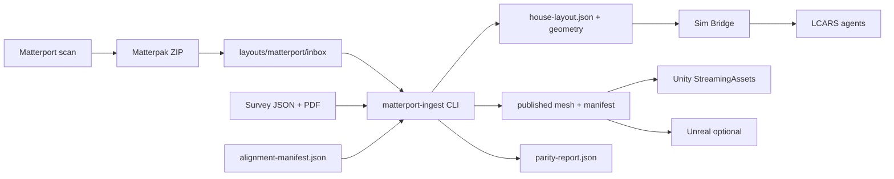

# Matterport ingestion — photogrammetry parity with survey

## Objective

Import **Matterport Matterpak** exports (OBJ mesh + textures + floor plans) and align them to the authoritative **survey layout** (`onimurasame-residence-2026-05-24.json` and `Scanned_20260524-1944.pdf`) so Unity and Unreal render the home at **1:1 scale** with verified tolerance.

**Note:** `MatterPort` elsewhere in ENTERPRISE docs refers to the **Matter IoT adapter** (`@enterprise/matter-port`), not Matterport scanning.

## Pipeline overview



## Prerequisites

1. Complete Matterport scan of the residence.
2. Order **Matterpak** add-on for the model ([Matterpak exports](https://matterport.com/add-ons/matterpak)) — provides `.obj`, `.mtl`, textures, floor plan images, point cloud.
3. Existing survey layout committed under `enterprise/sim/layouts/`.

## Step 1 — Drop Matterpak in inbox

```bash
# Extract or copy the Matterpak download
cp ~/Downloads/mp_matterpak_*.zip enterprise/sim/layouts/matterport/inbox/
```

## Step 2 — Discover bundle contents

```bash
cd enterprise/sim/matterport-ingest
npm install
npm run ingest -- discover ../layouts/matterport/inbox/mp_matterpak_*.zip
```

Record mesh bounds; use Matterport floor plan PNG/PDF alongside `Scanned_20260524-1944.pdf` to estimate **position**, **rotationY**, and **scale** for the alignment manifest.

## Step 3 — Author alignment manifest

Copy and edit:

`enterprise/sim/layouts/matterport/alignment-manifest.example.json`

| Field | Purpose |
|-------|---------|
| `surveyRef` | Authoritative `house-layout.json` path |
| `transform.position` | Translates mesh so `metadata.origin` (front entrance) matches survey |
| `transform.rotationEulerDeg` | Yaw to match PDF north / room orientation |
| `transform.scale` | Usually `[1,1,1]` if Matterpak is in meters; adjust if units differ |
| `controlPoints` | 3+ labeled point pairs; parity fails until deltas ≤ tolerance |

Set `meshPosition` on each control point after inspecting the raw OBJ in Blender or Unity (before final ingest).

## Step 4 — Ingest and verify parity

```bash
npm run ingest -- ingest \
  --bundle ../layouts/matterport/inbox/mp_matterpak_YOURMODEL.zip \
  --alignment ../layouts/matterport/alignment-manifest.json \
  --layout ../layouts/onimurasame-residence-2026-05-24.json \
  --out ../layouts/house-layout.json \
  --unity
```

Exit code `0` = parity **PASS** (`geometry.alignment.verifiedAt` set, `scaleVerified: true` on Matterport source).

Exit code `2` = parity **FAIL** — inspect `layouts/matterport/published/<model>/parity-report.json`, adjust manifest, re-run.

## Step 5 — Run digital twin stack

```bash
# Sim Bridge (serves layout + geometry manifest)
cd enterprise/sim/bridge && SIM_LAYOUT_PATH=../layouts/house-layout.json npm run dev

# Engine + LCARS (see sim/README.md)
cd enterprise/runtime && MATTER_ADAPTER=sim SIM_BRIDGE_URL=http://127.0.0.1:3002 npm run dev:engine
```

Unity: open `enterprise/sim/unity/ENTERPRISE.HouseHarness`, assign `MatterportMeshLoader` + `house-layout.json`. Play mode loads survey polygons **and** Matterport mesh when `geometry` is present.

## Unreal Engine

Same contract: read `GET /sim/geometry/manifest` from Sim Bridge, import OBJ with transform from `geometry.mesh.transform`. No Unreal project is bundled yet; protocol matches Unity.

## Optional — Matterport Model API

For automated Matterpak download (Enterprise API):

| Variable | Purpose |
|----------|---------|
| `MATTERPORT_API_TOKEN` | Model API admin token |
| `MATTERPORT_MODEL_ID` | Space model id |

GraphQL endpoint: `https://api.matterport.com/api/models/graph`. Order add-on `mp:matterpak`, poll until assets are `available`, then download ZIP to `inbox/`. API fetch script is planned; folder-based ingest works today.

## Parity targets (100% parity definition)

| Check | Default tolerance |
|-------|-------------------|
| Building footprint span X/Z | ≤ 2 cm vs survey envelope |
| Longest surveyed wall vs mesh extent | ≤ 3 cm |
| Control points (entrance, corners) | ≤ 1–3 cm per point |

Stations (`env.nest.primary`, doorbell) must remain inside traced room polygons after mesh alignment.

## Related docs

- [LAYOUT-INGESTION.md](./LAYOUT-INGESTION.md) — manual survey JSON
- [../README.md](../README.md) — digital twin harness
- [../matterport-ingest/README.md](../matterport-ingest/README.md) — CLI reference
