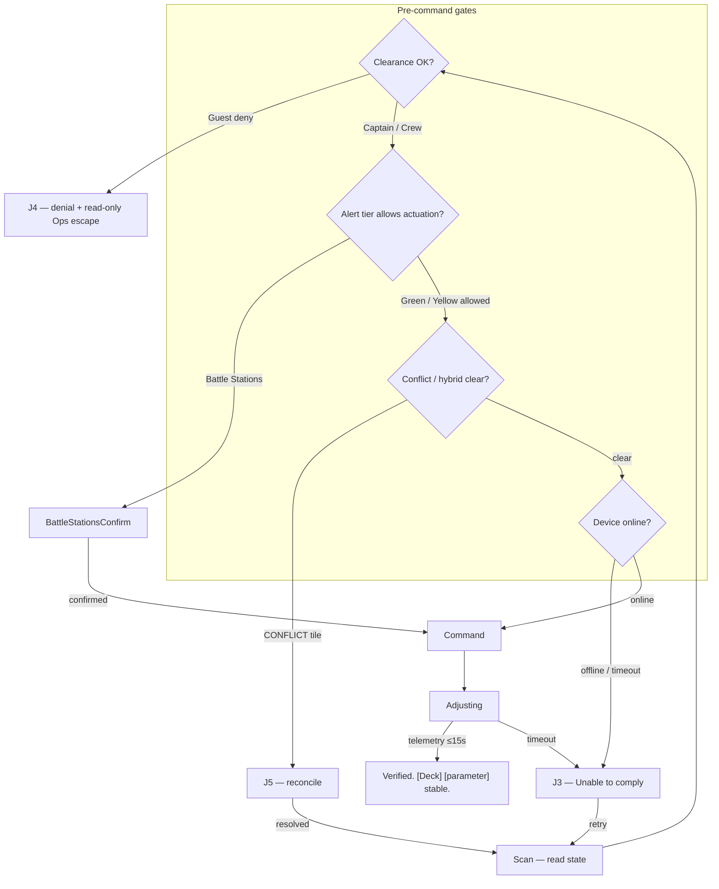
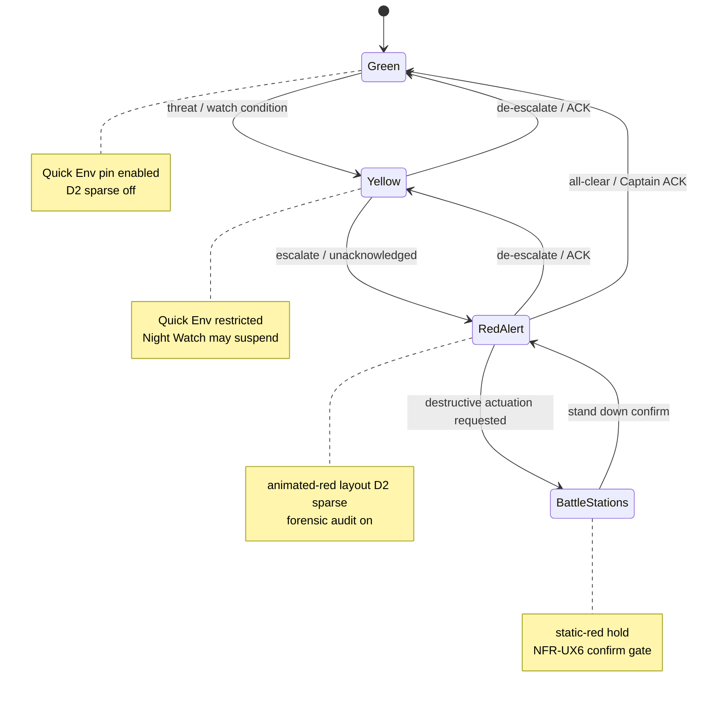
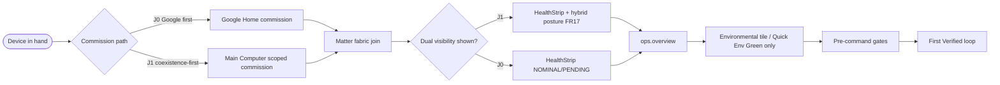
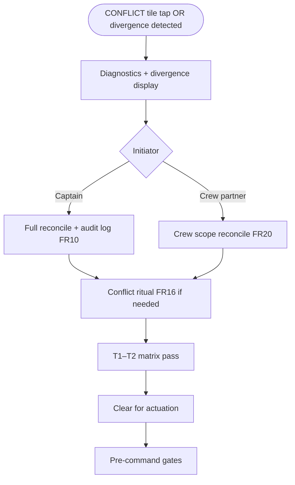
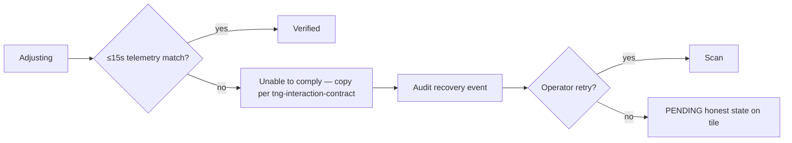
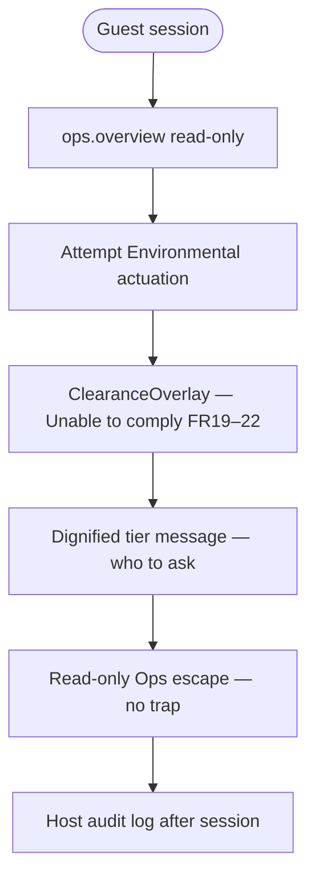
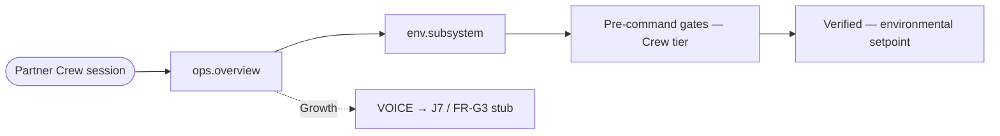
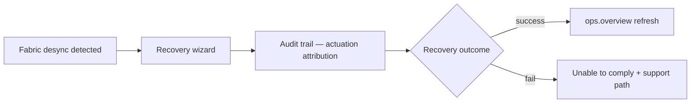
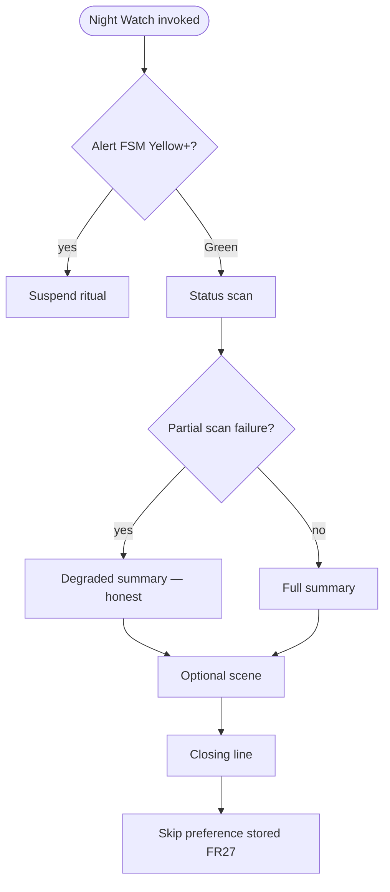

---
stepsCompleted:
  - step-01-init
  - step-02-discovery
  - step-03-core-experience
  - step-04-emotional-response
  - step-05-inspiration
  - step-06-design-system
  - step-07-defining-experience
  - step-08-visual-foundation
  - step-09-design-directions
  - step-10-user-journeys
  - step-11-component-strategy
  - step-12-ux-patterns
  - step-13-responsive-accessibility
  - step-14-complete
lastStep: 14
workflowStatus: complete
uxReviewCouncil:
  mandatory: true
  members:
    - Michael Okuda
    - Denise Okuda
    - Gene Roddenberry
    - Captain Jean-Luc Picard
    - Lt. Commander Geordi La Forge
    - Lt. Commander Data
    - Lieutenant Worf
  agentWorkingGroup:
    description: Command, engineering, security, and positronic automation
    leads:
      - Captain Jean-Luc Picard
      - Lt. Commander Geordi La Forge
      - Lt. Commander Data
    securityOfficer: Lieutenant Worf
inputDocuments:
  - enterprise/prd.md
  - enterprise/prd-validation-report.md
  - enterprise/matter-research-sources.md
  - enterprise/index.md
  - enterprise/tng-interaction-contract.md
  - enterprise/lcars-screen-inventory.md
  - enterprise/docs/artifacts/README.md
  - enterprise/docs/artifacts/art-01-coexistence-pack-v1.md
  - enterprise/docs/artifacts/art-02-conflict-taxonomy.md
  - enterprise/docs/artifacts/art-03-conflict-resolution-matrix.md
  - enterprise/docs/artifacts/art-04-hybrid-automation-bounds.md
  - enterprise/docs/artifacts/art-05-wan-down-soak-v0.md
  - enterprise/docs/artifacts/art-06-degraded-mode-matrix.md
  - enterprise/docs/artifacts/art-07-soak-reference-automation.md
  - enterprise/docs/artifacts/art-08-alert-condition-matrix.md
productName: ENTERPRISE Main Computer
workflowType: ux-design
uxNorthStar: home_starship_operations_center
okudaAudit: PASS_WITH_CONDITIONS
---

# UX Design Specification — ENTERPRISE Main Computer

**Author:** Onimurasame  
**Date:** 2026-05-18

---

## Executive Summary

### Project Vision

ENTERPRISE Main Computer is a **home starship operations center** — an authentic TNG LCARS shipwide system for a physical **battle bridge** (basement) with the **captain's chair** as the command authority node. The house is the vessel; Matter devices and custom sensors are **crew stations** reporting into one nervous system. The **Captain is the protagonist**.

This is **not** an HVAC control app with LCARS skin. MVP proves the first live station — **Environmental** (Nest Learning Thermostat, 4th gen) — inside a **whole-ship layout** where all departments (Environment, Tactical, Engineering, Science, Ops) appear from day one, with offline stations marked **SENSOR PENDING / OFFLINE** with cross-hatch and activation roadmaps.

**Okuda mandate:** Painfully obvious hierarchy; grid-based asymmetric LCARS; department color logic; **color is information**. Web LCARS and battle bridge console are **renderers** of the same Station API.

**Interaction contract** governs outcomes. **Experience pack** governs LCARS palette, department tokens, alert presentation, ritual copy.

**Alert discipline:** Green enables · Yellow restricts · Red Alert defends · **Battle Stations actuates**. Red Alert = **animated-red**; Battle Stations = **static-red**. Destructive baselines require **Battle Stations confirm gate** (constitutional — non-skippable).

**MVP proof:** Environmental truth loop + alert spine + Ops composited view + G1–G5 + [Starship MVP ACs](./../prd.md#starship-mvp-acceptance). **North star:** Full sensor suite, battle bridge, captain's chair as primary interface.

### Target Users

**Captain:** Ops aggregation default; command authority; hold-to-confirm Red; PIN + hold for Battle Stations stand-down. **Quick Environmental pin (Green only)** for daily comfort without abandoning command hierarchy.

**Crew:** Station-scoped environmental control; lighter routine fiction; no command alert controls; affordance removal when out of scope.

**Guest:** Separate chrome profile — hospitality copy, read-only comfort, session expiry visible; no authority/conflict chrome; alert banner read-only at Yellow+.

**Battle bridge visitors:** Instant Starfleet recognition — consistent typography, corner radius, department palette.

### Key Design Challenges

1. Whole-ship skeleton with OFFLINE/PENDING + roadmaps (not loading screens)  
2. Captain's chair = Ops — Environmental is subsystem drill-down  
3. One organism — stations not separate apps  
4. Alert modes change behavior before palette  
5. Proportional actuation — Battle Stations sub-state  
6. Truth loop on first live Environmental station  
7. Hybrid honesty — `POSTURE: HYBRID` as ship status chrome, not disclaimer  
8. Renderer parity — web + battle bridge same API  
9. Sensor taxonomy Class I–IV  
10. Physical bridge lighting/audio when hardware registers  
11. PRD sequencing vs vision — one device MVP, vessel UX north star  
12. Residential proportionality — prompt-not-auto-Red; guest grace (Growth network)  
13. Baseline transparency — 3s transition interstitial  
14. Night Watch suspends under alert with diegetic copy  
15. P0 keyboard path — HVAC subsystem + conflict reconcile  
16. Reverse-path discipline — alert spine + Environmental before hardware actuation  

### Design Opportunities

1. Authentic LCARS information design at battle bridge viewing distance  
2. Battle bridge as crisis command — compact Ops within chair reach  
3. Station model navigation  
4. Progressive station activation OFFLINE → PENDING → NOMINAL  
5. Alert-driven immersion (palette + optional physical effects)  
6. Red Alert vs Battle Stations as authentic TNG graduation  
7. Quick Environmental (Green) — daily loop without thermostat-app identity  
8. Grammar + chroma portable to voice/combadge  
9. Experience pack as ship computer soul  
10. Scene One — Nest as first Environmental station inside a vessel  
11. Pending baseline queue — auditable until stations register  
12. Plain-theme contract test  

### Alert Condition Model (summary)

Canonical detail: [ART-08](./docs/artifacts/art-08-alert-condition-matrix.md).

| Level | Baseline character | Configurable scope |
|-------|-------------------|-------------------|
| Green | Normal poll, schedules, coexistence | Full |
| Yellow | Tighter poll, event block, suspend non-critical; no destructive | Medium |
| Red Alert | Forensic audit, safe band, animated-red layout | Narrow |
| Battle Stations | Confirm gate + destructive queue (PENDING until hardware) | Minimal |

### Okuda Authenticity Audit (2026-05-18)

**Verdict:** PASS WITH CONDITIONS (Michael Okuda + Denise Okuda)

**Conditions applied in this spec:**

1. Default landing = `ops.overview` (not Environmental subsystem)  
2. Hybrid Mode badge = ship status chrome  
3. Guest = affordance removal, not disabled tease  
4. Animated-red vs static-red documented in motion rules  
5. OFFLINE tiles = cross-hatch + roadmap, never generic placeholder  

---

## Ops Overview — Bridge at a Glance (`ops.overview`)

**Hero screen.** First wireframe. Default route after auth/onboarding.

**Viewport:** ≥1024px; alert banner visible at 1280×720 (NFR-UX3).

### LCARS grid

```
┌─────────────────────────────────────────────────────────┐
│ [ALERT BANNER 32px — hidden Green; amber Y; red R/BS]   │
├──────────┬──────────────────────────────┬───────────────┤
│ LEFT ARC │         CENTER STACK         │  RIGHT ARC    │
│  (18%)   │           (52%)              │   (18%)       │
│ Dept     │  Vessel Status + Dept Summary│  Sensor       │
│ bars     │  5 station tiles (2×2 + Ops) │  Summary      │
│          │  Active Alerts feed          │  Power/Eng    │
│          │  [Quick Env pin — Green only]│  bars         │
├──────────┴──────────────────────────────┴───────────────┤
│ COMMAND LINE (outcome + Escalate)          │ HEALTH (12%)│
└─────────────────────────────────────────────────────────┘
```

### Vessel status chrome

- Alert condition (Green/Yellow/Red/Battle Stations)  
- Site name / vessel designation  
- **`POSTURE: HYBRID · EXTERNAL CONTROLLER ACTIVE`** when applicable  
- Local time, uptime  

### Department tiles

Environment · Tactical · Engineering · Science · Ops — states: NOMINAL / ADVISORY / OFFLINE / CONFLICT. OFFLINE = cross-hatch + roadmap one-liner.

### Alert visual law

| Level | Banner | Motion |
|-------|--------|--------|
| Green | Hidden | None |
| Yellow | Amber | Slow edge pulse |
| Red Alert | Crimson | **Animated-red** breathing |
| Battle Stations | Crimson + label | **Static-red** hold |

### Quick Environmental pin (Green only)

≤15% center width. Shows ship mean temp + expand to `env.subsystem`. Hidden or read-only at Yellow+.

### Tap targets

| Target | Destination |
|--------|-------------|
| Environment tile | `env.subsystem` |
| Tactical / Engineering / Science | Station detail or PENDING explainer |
| Alert row | `ops.conflict` / diagnostics |
| Escalate | Level-appropriate hold/confirm |
| Quick Env pin | Inline expand or drawer |

### Motion and audio (P0)

- Yellow entry: optional single chime (web or bridge)  
- Red Alert: 3-cycle klaxon burst → silence when audio available  
- Battle Stations: static-red; siren PENDING until hardware  

---

## Environmental Subsystem Panel (`env.subsystem`)

Drill-down from Environment tile or Quick Env pin. **Not default landing.**

**Labels:** Environmental Control — [Deck/Zone]. Avoid vendor product names on chrome.

**Shows:** Setpoint, mode, humidity, authority, conflict, pending state, last command.

**Ops must NOT show:** Setpoint steppers, commissioning wizards.

---

## UX / PRD phasing (summary)

| Capability | MVP P0 | Growth P1 | Vision P2+ |
|------------|--------|-----------|------------|
| Whole-ship skeleton | All dept tiles; Environment live | Multi-zone Env; first Tactical | All departments live |
| Alert FSM | Full FSM web; Env baselines | Zone propagation; audio | Physical alert panel |
| Battle bridge physical | Web renderer acceptable | Wall display | Basement battle bridge |
| Battle Stations actuation | Confirm gate; PENDING destructive | Locks, lighting | Full actuation |

Full table: [PRD Project Scoping](./../prd.md#ux--alert-phasing).

---

## UX Review Council (mandatory)

**Policy:** All ENTERPRISE UX decisions — wireframes, flows, copy, motion, alert behavior, screen inventory changes — require review by the **UX Review Council**. The Okudas are **always present**. Party Mode, elicitation, and spec amendments must include this roster unless the operator explicitly waives a member for a scoped decision (logged in spec revision notes).

**Character agents (canon specs):** [enterprise/docs/agents/](./docs/agents/) — Party Mode and senior staff meetings **must** load [VOICE-LAW.md](./docs/agents/VOICE-LAW.md) + each character's `## Invocation block` verbatim; do not paraphrase personas. Picard chairs [senior staff protocol](./docs/agents/process-senior-staff-meeting.md). Full council rounds follow [process-party-mode.md](./docs/agents/process-party-mode.md) (pre-flight, frozen decisions, decision ledger).

| Authority | Lens | UX veto domain |
|-----------|------|----------------|
| **Gene Roddenberry** | Vision | User-friendly = **clear organization of complicated information**; humanity in technology; no dystopian automation |
| **Michael Okuda** | LCARS information design | Grid hierarchy, alert-as-behavior, whole-ship skeleton, constitutional confirm gate |
| **Denise Okuda** | Production / experiential continuity | Department palette, cross-hatch OFFLINE, animated-red vs static-red, battle bridge recognition |
| **Captain Jean-Luc Picard** | Command authority | Captain chooses; escalation ethics; dignity under alert; no trap states; Incident Summary as command closure — [spec](./docs/agents/captain-picard.md) |
| **Lt. Commander Geordi La Forge** | Engineering truth | Interfaces match system state; diagnostics honest; PENDING ≠ broken; accessibility of critical paths — [spec](./docs/agents/lt-commander-la-forge.md) |
| **Lt. Commander Data** | Positronic automation / holodeck agents | Agent lifecycle (instantiate → train → deploy); holodeck programs on engine; capability boundaries; Growth-layer automation — [spec](./docs/agents/lt-commander-data.md) |
| **Lieutenant Worf** | Security | Clearance enforcement UX; audit visibility; threat posture chrome; hybrid coexistence seam; non-dismissible security indicators — [spec](./docs/agents/lieutenant-worf.md) |

**Agent working group (command):** Picard · La Forge · Data · Worf — holodeck/agent Growth work **must not** hijack Ops/alert surfaces during Yellow+. Agents mount as **runtime tenants** on Station API, not engine forks. Security policy **must be written** (Worf), not assumed.

**Voice law:** [VOICE-LAW.md](./docs/agents/VOICE-LAW.md) — product vocabulary only; no technobabble cosplay.

**Sign-off format for UX spec sections:** `Council: [names] — PASS | PASS WITH CONDITIONS | BLOCKED`

**Okuda audit (Step 02):** PASS WITH CONDITIONS — conditions applied in this document.

---

## Core User Experience

### Defining Experience

The core loop is **command from Ops**: the Captain opens the bridge, reads vessel status at a glance, and acts — escalate alert, drill into a department, or (Green only) adjust Environmental via Quick pin.

**Council synthesis:**

- **Roddenberry:** The product succeeds when complicated home systems appear **organized and learnable** — not simplified into a toy.  
- **Picard:** The Captain **commands**; the Computer ** advises and executes** after consent at Battle Stations.  
- **La Forge:** Every panel must reflect **actual system state** — if Engineering is OFFLINE, say so plainly with a path to fix.  
- **Okudas:** Ops overview is home; LCARS grammar is non-negotiable.

**Core action hierarchy:**

1. **Scan** — Ops overview + alert condition  
2. **Command** — Escalate/de-escalate, subsystem control, conflict reconcile  
3. **Confirm** — Working → Acknowledged; Battle Stations confirm gate  

### Platform Strategy

- **P0:** Web LCARS ≥1024px; keyboard paths for Environmental subsystem, conflict, alert ACK  
- **North star:** Battle bridge = same Station API renderer  
- **WAN-down:** Alert shell + Ops layout local (NFR-UX5)  
- **La Forge:** Diagnostic drill-down always reachable from health strip and Unable to comply  

### Effortless Interactions

- Quick Environmental pin (Green) — daily comfort without losing Ops context  
- Hold-to-confirm Red; Battle Stations interstitial — **Picard:** deliberate command under pressure  
- Authority indicator at Yellow+ — **Roddenberry:** honest coexistence, not false sovereignty  
- QUERY TRIGGER on false Yellow — **La Forge:** show the sensor chain  
- OFFLINE roadmaps — **Denise:** vessel incomplete but **real**  

### Critical Success Moments

| Moment | Success signal | Council owner |
|--------|----------------|---------------|
| First bridge view | Whole-ship skeleton; Environment NOMINAL | Okudas |
| First Acknowledged setpoint | Subsystem panel; wall unit ≤15s | La Forge |
| First Red Alert | Layout ≤3s; safe band; AC-S1 | Picard + Michael Okuda |
| Battle Stations | Static-red; Captain confirmed | Picard |
| 14-day dogfood | Ops is home | Roddenberry |

### Experience Principles

1. **Ship first, subsystem second** (Okudas)  
2. **Behavior before palette** (Michael Okuda)  
3. **Proportional actuation** — Red Alert aware; Battle Stations commits (Picard + Roddenberry)  
4. **Diegetic truth** (La Forge + contract)  
5. **Whole vessel always** (Denise Okuda)  
6. **Constitutional confirm** — Battle Stations gate non-skippable (Picard)  
7. **One renderer, many surfaces** (La Forge)  
8. **Dignity in denial** — clearance messages, not scolding (Roddenberry)  

**Council sign-off (Step 03):** Michael Okuda, Denise Okuda, Gene Roddenberry, Captain Picard, Lt. Commander La Forge — **PASS**

---

## Desired Emotional Response

### Primary emotional goals

| Emotion | When | Authority |
|---------|------|-----------|
| **Command competence** | Green — Ops | Roddenberry, Picard |
| **Organized capability** | Learning whole-ship skeleton | Roddenberry |
| **Calm focus** | Yellow Alert | Picard, Michael Okuda |
| **Lived urgency** | Red Alert (animated-red) | Okudas |
| **Resolved commitment** | Battle Stations (static-red) | Picard, Denise |
| **Partnership in failure** | Unable to comply + diagnostics | La Forge |
| **Living ship** | Quick Env anchor (Green); read-only strip (Yellow+) | Denise |
| **Relief at truth** | Conflict reconcile — device as tiebreaker | La Forge, Picard |
| **Closure** | Incident Summary stand-down | Picard |

**Roddenberry principle (non-negotiable):** The operator must always feel like the **Captain — never a passenger.** Automation visible, legible, revocable.

### Never create

Helplessness (HAL); false Done; silent PENDING; performative panic (exclamation marks, spinners under Yellow+); bureaucratic dismissal; cosplay skeleton without roadmaps; cry-wolf Yellow; shame-styled Hybrid badge; mid-flow Night Watch cut.

### Clearance-tier emotional depth (Picard)

| Persona | Same alert, different depth |
|---------|----------------------------|
| **Captain** | Full context + command affordances |
| **Crew** | Crisp readiness — act, don't decide for the ship |
| **Guest (Quarters)** | Calm orientation — stay clear, no jargon, no dual-controller noise |

### Environmental emotional flow (La Forge + Debate DB-1)

**Acknowledged → Adjusting → Verified** — one compact status line morphing, not three dialogs. Primary emotional peak: `Verified. [Deck] [parameter] stable.`

### Alert-level feelings

| Level | Feel | Motion / audio |
|-------|------|----------------|
| **Green** | Calm command | None; Quick Env pin |
| **Yellow** | Focus — facts, not anxiety | Amber pulse; 15s sampling band before entry |
| **Red Alert** | Urgent clarity | Animated-red; klaxon 3× → silence; status lines not spinners |
| **Battle Stations** | Chosen weight | Static-red; confirm interstitial |

### Micro-emotions (outcome types)

| Outcome | Emotion |
|---------|---------|
| Acknowledged | Heard — command accepted |
| Adjusting | Patient trust — actuators in motion |
| Verified | Relief + trust — primary success feeling |
| Warning | Focus — information |
| Denied | Redirect — clearance + path forward |
| Unable to comply | Supported — never alone |

**Guest denial (Picard):** `Clearance required for this section. Contact the duty officer or return to assigned quarters.`

### PENDING / OFFLINE (La Forge)

Micro-states: **Initializing → Sampling → Verifying**. Commissioner disconnect: hold last state, dim, timestamp + next update. Health strip encodes freshness — stale green labeled honestly.

### Hybrid / Google coexistence

Neutral `POSTURE: HYBRID · EXTERNAL CONTROLLER ACTIVE` chrome. Distinct external-controller voice in experience pack. Reconcile emotion: relief — device truth ends the argument.

### Night Watch Lite

Intercept before start. Suspend under Yellow+: `Night Watch suspended. Alert condition takes precedence.`

### Incident Summary

Mandatory ≤4 lines, past tense. Example: `Alert concluded. Duration 12 minutes. Environmental safe band released. All primary stations nominal.`

### Emotional trust pre-mortem (ET-1–ET-13)

Verified only Done; freshness on green; report don't spin; PENDING moves; external voice distinct; confirm ceremony; intercept before fiction; denial redirects; alert audio ends; stand-down exhale; hybrid not apology; Yellow earned; depth matches clearance.

### Matrix-selected decisions (normative)

3-phase Environmental flow; status lines under Yellow+; neutral Hybrid badge; Night Watch suspend; Quick Env read-only at Yellow+; Picard denial redirect; mandatory Incident Summary; distinct external voice; 15s sampling before Yellow; Quarters guest profile.

### Dogfood emotional acceptance

See PRD [Starship MVP Acceptance](./../prd.md#starship-mvp-acceptance) AC-E1–E5.

**Council sign-off (Step 04):** Michael Okuda, Denise Okuda, Gene Roddenberry, Captain Jean-Luc Picard, Lt. Commander La Forge — **PASS**

---

## UX Pattern Analysis & Inspiration

### Inspiring products analysis

| Source | What works | ENTERPRISE adaptation |
|--------|------------|------------------------|
| **TNG LCARS (Okuda canon)** | Grid hierarchy, color-as-information, alert behavior before palette | Normative — experience pack + ART-08; not a third-party skin |
| **NASA / mission control** | Status-first displays; explicit GO/NO-GO; call-and-response | `ops.overview` + Acknowledged → Adjusting → Verified + Incident Summary |
| **Aviation glass cockpit** | Primary flight display vs subsystem MFDs | Ops hero vs `env.subsystem` drill-down |
| **Industrial SCADA (selective)** | Timestamped alarms; stale-data indication | La Forge health strip + PENDING micro-states |

**Not inspiration (anti-reference):** Generic smart-home tiles, Google Home cards, Home Assistant default dashboards — thermostat-app identity we reject (PRD explicit non-goal).

### Transferable UX patterns

**Navigation:** Status-first command surface (Ops) → department drill-down — not device-list home.

**Interaction:** Call-and-response grammar; hold-to-confirm for Red/Battle Stations; QUERY TRIGGER before Yellow; status lines not spinners under Yellow+.

**Visual:** Asymmetric LCARS grid; animated-red vs static-red; cross-hatch OFFLINE; neutral Hybrid badge.

**Error:** Diegetic Unable to comply with timestamp + next update — never toast-only.

### Anti-patterns to avoid

Thermostat-as-home-screen; spinner under alert; disabled-button guest UI; "Access denied" copy; silent PENDING tiles; indistinguishable Google vs Computer chrome; Night Watch fiction during alert; sovereign cosplay in Hybrid Mode; HA entity-card layout as primary IA.

### Design inspiration strategy

**Adopt:** Okuda LCARS grid law + mission-control status hierarchy + La Forge timestamp discipline.

**Adapt:** SCADA alarm density → sparse TNG brevity at Red; aviation MFD → web tablet ≥1024px (NFR-UX1).

**Avoid:** Consumer IoT onboarding wizards as emotional home; infinite dashboard widgets; Material/Ant Design as visual foundation.

---

## State of the Art Review (May 2026)

**Objective:** Separate **supporting libraries** (integrate) from **product DNA** (build). Review date: **2026-05-19**. Sources: CSA/Matter 1.5.1, Matter Survey, Open Home Foundation matterjs-server track, npm/PyPI ecosystems, PRD architecture preview.

### Review methodology

Each layer scored:

| Verdict | Meaning |
|---------|---------|
| **INTEGRATE** | Mature library or sidecar; wrap behind adapter; do not fork UI |
| **REFERENCE** | Study patterns/tokens; do not depend in production |
| **BUILD** | No acceptable drop-in; core differentiator or Okuda mandate |
| **DEFER** | Growth/Vision; not MVP acceptance |

### Layer 1 — LCARS visual system (web + bridge renderers)

| Option | Status (May 2026) | Verdict | Notes |
|--------|-------------------|---------|-------|
| **Okuda experience pack (custom)** | N/A — product-owned | **BUILD** | Department tokens, alert visual law, clearance chrome, Ops grid — Okuda audit requires full control |
| **@starfleet-technology/lcars-react** (v0.0.3) | Early; ~negligible adoption; Stencil web components | **REFERENCE** | Buttons/chrome only; no alert FSM layout, no station skeleton, no clearance tiers |
| **lcars-ui.com** | Site shows "Please Stand By" | **REFERENCE** | Not production-ready |
| **joernweissenborn/lcars** (CSS) | Last meaningful update ~2021; v1.0.0-beta | **REFERENCE** | Layout ideas; stale; no React/alert modes |
| **louh/lcars** | HTML/CSS/JS responsive layout | **REFERENCE** | ~224★; good elbow geometry reference |
| **@withstudiocms/lcars-stylus** (v1.1.0, Mar 2026) | CSS/Stylus tokens + Astro | **REFERENCE** | Color curves and radii; port tokens into experience pack |
| **Material / Chakra / shadcn** | Production-grade a11y | **DO NOT ADOPT** as visual foundation | Conflicts with Okuda mandate; optional headless primitives only if hidden |

**Conclusion:** **100% custom LCARS component library** under experience pack. External LCARS npm packages are **reference material only**, not dependencies.

### Layer 2 — Web console application shell

| Option | Verdict | Notes |
|--------|---------|-------|
| **React 18+ / TypeScript 5+** | **INTEGRATE** | Aligns with LCARS ecosystem, XState React, a11y tooling; PRD MVP surface `web_lcars_console` |
| **Vite / Next (static export)** | **INTEGRATE** | SPA or SSG; no SSR requirement for LAN console |
| **TanStack Query** | **INTEGRATE** | REST snapshot + cache; pair with WS for events |
| **Radix / React Aria (headless)** | **INTEGRATE (selective)** | NFR-UX2 keyboard/focus — use headless, LCARS-styled |
| **hass-react / HA Lovelace patterns** | **AVOID** | Entity-card mental model; PRD rejects HA dashboard as primary UI |

**Conclusion:** Standard React TS stack + headless a11y — **integrate**. All LCARS visuals and IA — **build**.

### Layer 3 — Real-time transport (Station API)

| Option | Verdict | Notes |
|--------|---------|-------|
| **WebSocket event stream** (`/api/v1/events/stream`) | **BUILD** (contract) | Product-owned envelope (FR-H3); library-agnostic |
| **react-use-websocket / native WS** | **INTEGRATE** | Connection lifecycle only |
| **SSE** | **REFERENCE** | Fallback if WS blocked; not primary |
| **MQTT (internal bus)** | **DEFER** | Optional engine-internal; not LCARS-facing |

**Conclusion:** **Build** Station API + event schema. **Integrate** thin WS client.

### Layer 4 — Alert FSM & ritual orchestration

| Option | Verdict | Notes |
|--------|---------|-------|
| **Custom alert FSM** (Green/Yellow/Red/Battle Stations) | **BUILD** | ART-08 baselines, Battle Stations non-skippable gate (NFR-UX6), clearance-aware behavior |
| **XState v5** (~5.31.x, May 2026) | **INTEGRATE** | Machine definition + tests; map snapshots to LCARS layout modes |
| **Generic rules engines (json-rules-engine)** | **REFERENCE** | Automation bounds (ART-04), not alert FSM |

**Conclusion:** **Build** alert semantics; **integrate XState** as FSM engine if implementation language is TS — not a UX shortcut.

### Layer 5 — Matter device plane

| Option | Status (May 2026) | Verdict | Notes |
|--------|-------------------|---------|-------|
| **connectedhomeip (C++ SDK)** | Matter **1.5.1** spec; CSA reference | **INTEGRATE (via wrapper)** | Underpins all controllers; do not expose raw to UI |
| **python-matter-server** (v8.1.x) | Maintenance mode; CSA-certified HA path | **INTEGRATE (MVP option A)** | Stable WebSocket API; 68k+ PyPI downloads/mo; wrap as Matter adapter |
| **matterjs-server** + **@matter/main** | Alpha/beta; HA 8.2+ beta toggle (Jan 2026); Matter 1.4.2 | **INTEGRATE (MVP option B — preferred trajectory)** | Open Home Foundation; replacing Python server; monitor CSA re-cert |
| **chip-tool / Python CHIP REPL** | Dev controllers | **DEV ONLY** | Commissioning debug, CI harness |
| **Home Assistant Core** | Mature | **DO NOT ADOPT** as product core | Use Matter *server* optionally; never HA UI/entity model as primary |
| **Nest 4th gen (MVP device)** | CSA cert Oct 2025; ~36% Thermostat cluster optional features | **INTEGRATE (device)** | Sufficient for setpoint/mode MVP; no schedules/fan via Matter — document gaps |

**MVP adapter decision (pick one, abstract behind interface):**

1. **Conservative:** python-matter-server sidecar — proven, certified, maintenance-only acceptable for P0 soak.  
2. **Forward-looking:** matterjs-server — align with OHF roadmap; require beta soak before G1/G2 sign-off.

**Conclusion:** **Build** orchestration engine + cluster→department mapping + conflict layer (ART-02/03). **Integrate** Matter controller **server** as subprocess — **do not build** a from-scratch Matter stack.

### Layer 6 — Identity, clearance, RBAC

| Option | Verdict | Notes |
|--------|---------|-------|
| **Local session + clearance tiers** (Captain/Crew/Guest) | **BUILD (MVP)** | FR19–22; Picard denial copy; not OIDC-shaped |
| **Authentik / Zitadel** | **DEFER (Growth OAuth)** | NFR-S12; Google OAuth transition — external IdP adapter |
| **Matter fabric ACL** | **INTEGRATE (device plane)** | Separate from app clearance UX |

**Conclusion:** **Build** clearance model for MVP. **Integrate** IdP when OAuth phase lands.

### Layer 7 — Experience pack & config slots

| Option | Verdict | Notes |
|--------|---------|-------|
| **JSON/YAML pack manifest** (tokens, copy, audio refs, ritual scripts) | **BUILD** | PRD customization model; NFR-O3 version skew rejection |
| **CSS variables / design tokens pipeline** | **BUILD** | Sourced from Okuda spec; lcars-stylus as reference only |
| **i18n framework (formatjs)** | **DEFER** | English bridge copy MVP |

**Conclusion:** Entirely **build** — this is the product's swappable face.

### Layer 8 — Automation, scenes, Night Watch Lite

| Option | Verdict | Notes |
|--------|---------|-------|
| **Night Watch Lite scheduler** | **BUILD** | FR26–27; alert intercept/suspend |
| **Matter Enhanced Scenes (1.4+)** | **INTEGRATE (device)** | Scene storage on controller; map to ship rituals |
| **Node-RED / HA automations** | **AVOID** | Wrong abstraction for TNG grammar |

**Conclusion:** **Build** ritual/automation policy layer; **integrate** Matter scene primitives where spec covers device types.

### Layer 9 — Audio, voice, combadge (Growth / Vision)

| Option | Verdict | Notes |
|--------|---------|-------|
| **Klaxon / alert audio assets** | **BUILD** (pack) | 3× Red Alert then silence — experience pack |
| **Whisper / Piper / local LLM** | **DEFER** | Voice Computer — not MVP |
| **Matter 1.5 chime/intercom** | **DEFER** | Tactical/combadge adjacency |

### Layer 10 — Physical battle bridge renderer

| Option | Verdict | Notes |
|--------|---------|-------|
| **Station API v1** | **BUILD** | Same snapshot/events as web LCARS |
| **bridge-station adapter** | **BUILD (Growth)** | Optional `enterprise-bridge/` integration |
| **Kiosk shell (Electron / Chromium)** | **INTEGRATE** | Display-only wrapper |

**Conclusion:** Web LCARS is first renderer; physical bridge is **second consumer of same API** — not a separate app.

---

### Build vs integrate summary (MVP P0)

```text
┌─────────────────────────────────────────────────────────────┐
│  BUILD (product DNA)                                        │
│  • Okuda LCARS component library + experience pack          │
│  • Ops overview / station skeleton / clearance chrome       │
│  • TNG interaction contract copy layer                        │
│  • Orchestration engine (policy, audit, conflict, health)   │
│  • Alert FSM semantics + Battle Stations gate               │
│  • Station API REST + WS event envelope                     │
│  • Night Watch Lite + hybrid coexistence UX (ART-01)        │
└─────────────────────────────────────────────────────────────┘
                              │
                              ▼
┌─────────────────────────────────────────────────────────────┐
│  INTEGRATE (supporting libraries / sidecars)                │
│  • matterjs-server OR python-matter-server (Matter adapter) │
│  • connectedhomeip (transitive — do not fork)               │
│  • React + TS + Vite + headless a11y                        │
│  • XState (FSM engine) · TanStack Query · WS client         │
│  • Zod (schema validation) · Vitest/Playwright (CI)         │
└─────────────────────────────────────────────────────────────┘
                              │
                              ▼
┌─────────────────────────────────────────────────────────────┐
│  REFERENCE ONLY (no production dependency)                  │
│  • joernweissenborn/lcars · louh/lcars · lcars-stylus       │
│  • @starfleet-technology/lcars-* · lcars-ui.com             │
└─────────────────────────────────────────────────────────────┘
```

### Risk register (library choices)

| Risk | Impact | Mitigation |
|------|--------|------------|
| matterjs-server beta instability | G1/G2 soak fail | Abstract Matter adapter; default python-matter-server until matterjs-server passes ART-05 |
| matter.js not CSA-certified | Compliance narrative | Product is controller UX + orchestration; use certified server path for MVP marketing |
| LCARS npm immaturity | Visual debt | Custom design system (Step 06); zero dependency on v0.0.x packages |
| Nest partial Thermostat cluster | Feature gap | MVP scope = setpoint/mode only; surface unsupported optional clusters honestly |
| Matter spec churn (2×/yr minors) | Adapter drift | Pin supported Matter version; modular cluster handlers per matter-research-sources §8 |
| HA ecosystem gravity | Wrong IA | Never import HA frontend; Matter server API only |

### Recommended MVP stack posture (non-normative)

Pending `architecture.md`, UX-aligned implementation default:

| Tier | Choice |
|------|--------|
| **UI** | React 18 + TypeScript + custom Okuda design system |
| **FSM** | XState v5 for alert + ritual states |
| **API** | REST snapshot + WebSocket events (Station API v1) |
| **Matter** | matterjs-server (beta soak) with python-matter-server fallback |
| **Device MVP** | Nest Learning Thermostat 4th gen via Thermostat cluster subset |
| **Identity** | Built-in clearance sessions (OAuth adapter stub for Growth) |

**Council sign-off (Step 05):** Michael Okuda, Denise Okuda, Gene Roddenberry, Captain Jean-Luc Picard, Lt. Commander Geordi La Forge — **PASS** (custom LCARS confirmed; Matter server integrate-not-fork; HA UI rejected)

---

## Design System Foundation

### Design system choice

**Custom Okuda LCARS Design System** — product-owned component library under experience pack.

**Headless accessibility only:** Radix/React Aria for keyboard, focus, and ARIA semantics — all default visual styles explicitly zeroed; LCARS tokens govern appearance.

**Rejected as visual foundation:** Material, Chakra, shadcn; LCARS npm packages as production dependencies (reference-only per SOTA review).

### Rationale

- Okuda audit requires full control of grid, alert visual law, department color-as-information
- npm LCARS libraries (v0.0.x, stale CSS) — geometry and color-curve reference only
- Headless layer satisfies NFR-UX2 without leaking browser-form chrome
- Roddenberry: custom identity serves Captain-not-passenger; MVP scope locked to first operational station
- Picard + Roddenberry hybrid CI gate balances command dignity with solo-builder velocity

### Implementation approach

**Five layers:**

1. **Tokens** — experience pack manifest with `schemaVersion`; semantic role on every color token (department | alert | system); motion tokens for animated-red vs static-red; `--operator-tier` (captain | crew | guest) for tap targets and corner radii; department palette swap at token layer only; `gamutProfile: srgb-mvp` with `bridge-led-v1` reserved (promotion criteria before bridge hardware integration); screen inventory IDs bound to token namespace
2. **Primitives** — elbows with minimum taper ratios on `ButtonElbow` (full geometry catalog Growth); bars, pills, status lines, data readouts; portability flags (`web | bridge | both`)
3. **Composites** — `AlertBanner`, `HealthStrip` (staleness via FSM guard, not CSS toggle), `ClearanceOverlay`, `BattleStationsConfirm`, Hybrid posture badge
4. **Screens** — mapped to [lcars-screen-inventory.md](./lcars-screen-inventory.md) IDs in token namespace
5. **Renderer contract** — web LCARS + future battle bridge consume same token/composite API; parity contract tests

**MVP component inventory (12):**

| Component | Layer | Sprint |
|-----------|-------|--------|
| `LcarsPanel` | Primitive | 1 |
| `AlertBanner` | Composite | 1 |
| `BattleStationsConfirm` | Composite | 1 (early graduate) |
| `ClearanceOverlay` | Composite | 1 (early graduate) |
| `LcarsBar` | Primitive | 2 |
| `StatusIndicator` | Primitive | 2 |
| `HealthStrip` | Composite | 2 |
| `DataReadout` | Primitive | 2 |
| `ButtonElbow` | Primitive | 2 |
| `SystemLabel` | Primitive | 2 |
| `SubsystemGrid` | Composite | 2 |
| `ConnectionBadge` | Composite | 2 |

**Phased delivery (La Forge):** Sprint 1 — tokens + renderer contract + four components above marked sprint 1; sprint 2 completes Environmental + Ops surfaces.

### Headless integration gate (A′+B′+ — Council hybrid)

| Surface | Rule |
|---------|------|
| **Shared library** (primitives + composites) | Zero Radix/React Aria visual leakage — CI blocks merge to `main` |
| **Early graduates** | `BattleStationsConfirm`, `ClearanceOverlay` enter shared library sprint 1 |
| **Feature-flagged routes on `main`** | Flag off by default; inline wrappers only (eslint import allowlist); no new shared exports; automated Playwright screenshot diff on **all flag-on states × 1280×720 + tablet breakpoints** every PR |
| **Scaffold TTL** | Auto-created cleanup story; CI **blocks merge** if flag remains after due date or story closed without flag removal |
| **Operator routes** (dogfood / G3) | Unflagged only after full zero-leak audit |
| **Sprint open** | Screen-classification table: `feature-flagged` vs `operator-facing` — reviewed at sprint open |

### Customization strategy

Experience pack owns palette, department accents, ritual copy, alert audio, motion curves. Engine rejects pack/engine version skew (NFR-O3). Reference joernweissenborn/lcars and lcars-stylus for color curves only — never import. `gamutProfile` travels with certificate artifact at freeze time (Denise — Step 07 gate if missing).

**Council sign-off (Step 06):** Michael Okuda, Denise Okuda, Gene Roddenberry, Captain Jean-Luc Picard, Lt. Commander Geordi La Forge — **PASS WITH CONDITIONS** (phased delivery; gamut promotion criteria; certificate fixture coupling)

---

## Defining Core Interaction

*Step 07 deepens [Core User Experience](#core-user-experience) (Step 03) — the single interaction that must be perfect.*

### Defining experience

**Elevator line:** *"I open the bridge, see the whole vessel, command the living deck, and the Computer proves it happened."*

**The defining loop — Scan → Command → Verified:**

| Phase | Screen | Captain action | Success signal |
|-------|--------|----------------|----------------|
| **Scan** | `ops.overview` | Read alert condition + department tiles + health strip | Whole-ship skeleton; honest OFFLINE/PENDING |
| **Command** | `env.subsystem` or Quick Env pin (Green) | Setpoint/mode submit | `Acknowledged` → `Adjusting` |
| **Verified** | Same panel or Ops return | Wait / glance status line | `Verified. [Deck] [parameter] stable.` |

If Verified fails within SLA, the loop still succeeds when **Unable to comply** appears with timestamp, cause, and one-tap diagnostics (La Forge). **Acknowledged alone is not success** (AC-E2, ET-1).

**Not the defining experience:** Opening a thermostat app; scrolling a device list; a toast saying "Done."

### User mental model

| Users bring (today) | ENTERPRISE reframes as |
|---------------------|------------------------|
| One vendor app per device | One vessel — departments are **stations** |
| "Did it work?" after tap | **Verified** = device subscription truth |
| Dashboard = home | **Ops overview** = battle bridge |
| Alert = phone notification | Alert = **ship mode** (behavior before palette) |
| Guest = limited user account | Guest = **Quarters clearance** — orientation, not crippled UI |

**Confusion risks and mitigations:**

| Risk | Mitigation |
|------|------------|
| Thermostat-as-home | Default route `ops.overview`; Environmental is drill-down |
| False Done at Acknowledged | 3-phase line; Verified is only success peak |
| Silent Google override | `POSTURE: HYBRID` + reconcile affordance ≤10s (AC-S3) |
| OFFLINE shame | Cross-hatch + activation roadmap (not spinner) |
| Alert cosplay | ART-08 baselines change behavior, not only color |

### Success criteria

| ID | Criterion | Target / gate |
|----|-----------|---------------|
| **DC-1** | Ops → Verified (Green, Environmental) | ≤15s p95 (NFR-P2) |
| **DC-2** | First bridge view | Whole-ship skeleton; Environment NOMINAL or honest OFFLINE |
| **DC-3** | Verified trust (dogfood) | AC-E5 ≥4/5 first Verified setpoint |
| **DC-4** | Captain-not-passenger | AC-E1 weekly check-in |
| **DC-5** | Alert layout transition | ≤1s p95 (NFR-UX4) |
| **DC-6** | No Verified skip | AC-E2 — Acknowledged without Adjusting/Verified unless Unable to comply |
| **DC-7** | `gamutProfile` in certificate fixture | Confirmed before Step 08 visual freeze (Denise, Step 06) |

### Novel vs established patterns

**Established (adapted):**

- Mission-control status board → `ops.overview` department grid  
- Aviation MFD drill-down → subsystem panels per [lcars-screen-inventory.md](./lcars-screen-inventory.md)  
- Call-and-response command grammar → [tng-interaction-contract.md](./tng-interaction-contract.md) outcome types  

**Novel (product DNA):**

- Alert FSM (Green/Yellow/Red/Battle Stations) changes **chrome and behavior** together  
- Battle Stations as **actuation sub-state** with non-skippable confirm gate  
- OFFLINE/PENDING **roadmaps** on whole-ship skeleton from day one  
- Hybrid posture as **ship status chrome**, not legal disclaimer  
- Single morphing status line (Acknowledged → Adjusting → Verified) as emotional peak  

**Teaching model:** No onboarding wizard. First `ops.overview` view teaches IA via diegetic labels (`Environmental subsystem`, department tiles, alert banner). Guest Quarters profile uses hospitality copy without dual-controller jargon.

### Experience mechanics

**1. Initiation**

- Post-auth default: `ops.overview` (Captain clearance)  
- Health strip shows commissioner freshness; ConnectionBadge shows WS state  
- Green: Quick Environmental pin visible; Yellow+: read-only env strip  

**2. Interaction**

- **Path A (routine):** Green → Quick pin → setpoint → submit (keyboard path NFR-UX2)  
- **Path B (full):** Ops → Environmental tile → `env.subsystem` → setpoint/mode → submit  
- **Path C (alert):** Escalate via alert controls → hold-to-confirm Red → Battle Stations interstitial if actuation required  
- **Denied paths:** Yellow+ env setpoint → Picard redirect; Guest → Quarters denial copy  

**3. Feedback**

- Status line morphs: Acknowledged → Adjusting → Verified (no spinner under Yellow+)  
- Conflict: authority banner + `[EXTERNAL OVERRIDE DETECTED]` when applicable  
- Stale telemetry: HealthStrip FSM → Warning or Unable to comply (C-STALE class)  
- PENDING micro-states: Initializing → Sampling → Verifying  

**4. Completion**

- **Success:** `Verified. [Deck] [parameter] stable.` — operator may return to Ops without context loss  
- **Failure:** Unable to comply + diagnostics one tap from status line  
- **Alert closure:** Incident Summary (≤4 lines, past tense) before stand-down  

```text
ops.overview ──► env.subsystem ──► [submit setpoint]
     │                                    │
     │                                    ├─ Acknowledged
     │                                    ├─ Adjusting
     │                                    └─ Verified ✓  (defining peak)
     └─ Quick pin (Green only) ───────────┘
```

**Council sign-off (Step 07):** Michael Okuda, Denise Okuda, Gene Roddenberry, Captain Jean-Luc Picard, Lt. Commander Geordi La Forge — **PASS**

---

## Visual Design Foundation

### Color system

**Brand:** TNG LCARS (Okuda) — color is information; no decoration-only tokens.

| Token class | Role |
|-------------|------|
| **Department** | Station identity — palette swap at token layer only |
| **Alert** | Green nominal · Yellow amber pulse · **Red Alert animated-red** · **Battle Stations static-red** |
| **System** | Health fresh/stale · Hybrid posture · OFFLINE cross-hatch |
| **Clearance** | Operator tier accent weight — not department truth |

**Alert motion law (normative):**

- `motion.alert.animated-red` — **Red Alert only**; **prohibited** on static indicators, Battle Stations, and nominal tiles
- `motion.alert.static-red` — **Battle Stations only**; never animated; ≥ ΔE 5.0 from Red Alert

**gamutProfile:**

- `srgb-mvp` — web/tablet MVP (values in experience pack + [certificate fixture](./docs/fixtures/visual-foundation-freeze.certificate.yaml))
- `p3Fallback` — documented hue/L\* map for bridge LED panels
- `bridge-led-v1` — exact delta from sRGB + hardware trigger condition before physical bridge integration

**MVP visual freeze scope:** alert + Ops + Environmental tokens only (La Forge).

### Typography system

| Role | Spec |
|------|------|
| **System labels** | LCARS sans, uppercase, wide tracking |
| **Data readouts** | Tabular numerals — setpoints, timestamps |
| **Minimum size** | **12px** Captain/Crew active contexts; Guest Quarters 11px with larger tap targets |
| **Hierarchy** | Alert banner > Ops tiles > subsystem > metadata |

**Roddenberry test:** Critical state readable in **<2 seconds** at 1280×720 Captain tier.

### Spacing and layout foundation

- **Base rhythm:** 8px grid; **4px sub-grid** permitted for elbow taper geometry only
- **ButtonElbow:** minimum corner-radius floor **4px** explicit — not derived from scale alone
- **Layout:** Asymmetric LCARS grid; Ops hero → subsystem drill-down; NFR-UX3 conflict/authority visible without horizontal scroll at 1280×720
- **Red Alert density:** sparse — no additional widgets during urgency (Picard)

### Accessibility considerations

- NFR-UX2 keyboard path on Environmental control
- **Focus:** LCARS token-defined focus (`focus.ring.style: lcars-native`) — zero browser default rings on operator routes
- **Audio:** Klaxon **3× then silence** for Yellow; **Red Alert klaxon until operator ACK** — no auto-silence
- `--operator-tier` guest: larger targets, reduced command chrome
- **Certificate:** [visual-foundation-freeze.certificate.yaml](./docs/fixtures/visual-foundation-freeze.certificate.yaml) — contrast matrix includes `--alert-amber` **#C57308** (≥3:1 on white; P1-minor tracked)

**Council sign-off (Step 08):** Michael Okuda, Denise Okuda, Gene Roddenberry, Captain Jean-Luc Picard, Lt. Commander Geordi La Forge — **PASS** (continue gate 5/5)

---

## Design Direction Decision

**Operator assumption (locked):** *This panel serves a trained crew member who owns their station.*

**Process record:** Full council + TRIAX reconciliation documented in [process-party-mode.md](./docs/agents/process-party-mode.md) (`ledgerVersion` 1.1.0). Step 09 saved 2026-05-19.

**Interactive showcase:** [ux-design-directions.html](./ux-design-directions.html) — D1–D6 at Green and Red Alert states.

### Design Directions Explored

Six LCARS-native directions within Okuda canon (not Material / smart-home variants):

| ID | Direction | Character | Council status |
|----|-----------|-----------|----------------|
| **D1** | Ops Command | Hero `ops.overview`, department grid dominant, Quick Env pin subtle | **Chosen (base)** |
| **D2** | Spare Captain's Chair | Larger labels, fewer tiles visible, max whitespace; Red Alert sparse mode | **Chosen (density mode)** |
| **D3** | Department identity (TRIAX) | Label / rail / fill channels — not fill-only chromatic | **Chosen (token layer)** |
| **D4** | Alert-Forward | Banner + health strip top 25%; compresses under Yellow+ | **Blocked** (R-02) until banner hidden at Green |
| **D5** | Hybrid Honest | Persistent `POSTURE: HYBRID` strip | **Merged** into `HealthStrip` (not separate frame) |
| **D6** | Dense Mission Control | Higher tile density, SCADA-like | **Rejected** MVP (R-01); opt-in ≥1440px deferred (D-14) |

### Chosen Direction

**D1 Ops Command + D2 Spare Captain's Chair hybrid** with:

- **TRIAX** (Three-Channel Departmental Persistence) for department identity on `SubsystemGrid` tiles  
- **D5** coexistence posture absorbed into **`HealthStrip`** as ship-status chrome (Roddenberry framing — not Google watermark)

### TRIAX FSM binding (normative)

| Alert FSM | Label | Rail (4px tile edge) | Fill |
|-----------|-------|----------------------|------|
| Green | Full `color.dept.{id}.label` | Full `color.dept.{id}.rail` | Full `color.dept.{id}.fill` |
| Yellow | 100% label | 50% opacity rail + fill | 50% opacity |
| Red Alert | Full label chroma (wayfinding) | 20% luminance rail | 5% opacity fill |
| Battle Stations | Luminance-only label | `color.dept.{id}.suppressed` | suppressed |

**Chrome exclusion (Worf):** TRIAX channels apply to **tile content only** — never `chrome.session`, `chrome.vessel`, or `BattleStationsConfirm` substrate.

**Motion:** 200ms ease-out per channel at density transition; stagger label → rail → fill.

**Merge blocker:** Register `color.dept.*.suppressed` in certificate before TRIAX ships ([D-09](./docs/agents/process-party-mode.md#deferred-work-recorded--not-lost)).

### Design Rationale

- **Roddenberry / AC-E1:** D1 organizes complicated information; D2 proves two-second read under stress — same principle at two scales. D6 rejected as passenger/SCADA architecture.  
- **Okuda:** Alert-as-behavior; animated-red owns urgency; department identity retreats by FSM tier, not erased.  
- **Picard:** Command focus at Red Alert — sparse D2 mode without losing whole-ship skeleton (five department tiles always visible).  
- **Reconciliation:** TRIAX resolved D3 tension by decomposing one overloaded word (`chromatic`) into three channels.

### Implementation Approach

| Layer | Action |
|-------|--------|
| **Layout** | D1 grid at Green; D2 typography scale + sparse chrome at Red Alert / Battle Stations |
| **Tokens** | TRIAX scalars per department in experience pack; `HealthStrip` carries D5 posture badge |
| **Components** | Sprint 1: `BattleStationsConfirm`, `ClearanceOverlay`; Sprint 2: `HealthStrip`, `SubsystemGrid`, remainder of 12-component phase plan |
| **Blocked** | D4 exploration until banner-at-Green spec patch; D6 MVP; TRIAX certificate until D-09 |
| **Architecture** | [architecture.md](./architecture.md) must name Station API mount + TRIAX contract before implementation sprint (D-01) |

**Revision notes:** Ledger IDs A-01, A-02, A-03, F-02, F-03, F-04; rejected R-01, R-02, R-10. Deferred D-01, D-04, D-09, D-14, D-16 remain open.

**Council sign-off (Step 09):** Michael Okuda, Denise Okuda, Gene Roddenberry, Captain Jean-Luc Picard, Lt. Commander Geordi La Forge, Lt. Commander Data, Lieutenant Worf — **PASS**

---

## User Journey Flows

**Source:** [PRD User Journeys](./prd.md#user-journeys) · Party Mode Step 10 · Advanced Elicitation (persona focus group, reverse engineering, comparative matrix).

**Operator assumption:** *This panel serves a trained crew member who owns their station.*

**Excluded from MVP flows:** J7 Voice, J8 OSS contributor, holodeck/agent tenancy (F-01, R-05).

**Authoring order (matrix-optimized):** Alert FSM → J0+J1 → J5 → J3 → J4 → J6 → F1 → J2.

### Pre-command gates (shared subgraph)

All environmental **actuation** journeys embed this gate chain before `Command`. Reverse-engineered from defining peak: `Verified. [Deck] [parameter] stable.`



### Alert FSM spine

Normative ops-runtime flow for alert tier transitions. Co-dependent with J5 conflict handling. Includes **de-escalation** to Green (persona + reverse-eng).



**Screens:** `ops.overview`, `AlertBanner`, `BattleStationsConfirm`, `HealthStrip` (D5 posture). **Refs:** ART-08, NFR-UX4–UX6.

### J0+J1 — Commission to first Verified

Merged flow: shared commissioning path; branch on dual-visibility (La Forge). Entry to `ops.overview` whole-ship skeleton (F-02).



**FR coverage:** FR1, FR6, FR7, FR13, FR17, FR38–FR39. **Success:** wall unit matches ≤15s; operator lands on Ops home, not thermostat app.

### J5 — Two controllers / conflict

Entry via **CONFLICT** tile on `ops.overview` (Okuda). Captain-initiated and **crew-initiated** branches (persona focus group).



**Audit (Worf):** reconciliation actuation logged. **Blocks Verified** until clear (reverse-eng RE-02).

### J3 — Unable to comply

Diegetic failure from Adjusting timeout or offline device. Recovery logged (FR34–FR35).



### J4 — Guest clearance

Full denial skeleton (Worf). Denial is **success** for Guest actuation — must not reach Adjusting/Verified on actuation.



**Deferred:** full FR19–FR22 NFR text (D-10); flow skeleton required at Step 10.

### J6 — Crew environmental

Minimal **happy path** at Crew clearance (matrix CM-01) plus voice deferral.



**FR coverage:** FR13, FR20. Voice explicitly out of MVP.

### F1 — Fabric desync (failure journey)

Required in Step 10 (Worf). Audit who actuated (FR11, FR41).



**Deferred:** F2 commission timeout, F3 Thread BR offline — unless clearance chrome touched.

### J2 — Night Watch Lite

Ritual after operator trusts Verified loop (Roddenberry). **Never emits Verified** — scan summary ≠ comfort loop (RE-06).



**FR coverage:** FR25–FR27, FR33.

### Journey Patterns

Reusable patterns extracted across flows (Step 10 elicitation).

| Pattern | Description | Journeys |
|---------|-------------|----------|
| **Ops home entry** | Default post-auth surface is `ops.overview`, not device app | J0+J1, J4 read-only |
| **Pre-command gates** | Shared subgraph before any actuation | J0+J1, J5, J6, J3 |
| **Scan → Command → Verified** | Defining loop; peak copy locked Step 07 | J0+J1, J6 |
| **Conflict before comfort** | J5 gate blocks Verified when CONFLICT active | J5, gates |
| **Alert-aware UI** | FSM changes density (D2), motion law, actuation scope | Alert FSM, J2 suspend |
| **Clearance dignity** | Denial names tier + escape path, not scolding | J4 |
| **Honest PENDING** | OFFLINE/PENDING ≠ broken; cross-hatch + roadmap | J3, J0+J1, gates |
| **Audit on recovery** | Unable to comply and reconcile events logged | J3, J5, F1 |
| **Growth stub terminal** | `[VOICE → J7]` branch — not MVP path | J6 |

**Tier summary:**

| Tier | Flows |
|------|-------|
| P0 | Alert FSM, J0+J1, J5, J3 |
| P1 required | J4, J6, F1 |
| P1 last | J2 |

**Implementation note (D-01):** UX-layer flows authoritative for screen IDs and FSM; Station API mount details land in `architecture.md` before implementation sprint.

**Council sign-off (Step 10):** Michael Okuda, Denise Okuda, Gene Roddenberry, Captain Jean-Luc Picard, Lt. Commander Geordi La Forge, Lieutenant Worf — **PASS WITH CONDITIONS** (J4 denial skeleton; J2 partial-scan branch; de-escalation on Alert FSM — conditions met in this section)

---

## Component Strategy

**Process record:** Party Mode Step 11 + Advanced Elicitation (ADR, Failure Mode Analysis, reverse engineering — Worf security contracts). [process-party-mode.md](./docs/agents/process-party-mode.md) ledger **A-09**.

**Operator assumption:** *This panel serves a trained crew member who owns their station.*

### Design system components

**Custom Okuda LCARS only** (F-05) — experience pack + five-layer stack from Step 06. No Material/Chakra/shadcn as visual foundation. Optional headless primitives hidden behind zero-leak CI (A′+B′+).

### Custom components — MVP inventory (15)

| # | Component | Layer | Sprint | Primary journeys / screens |
|---|-----------|-------|--------|----------------------------|
| 1 | `LcarsPanel` | Primitive | 1 | All surfaces |
| 2 | `AlertBanner` | Composite | 1 | Alert FSM; **`stand-down-summary` phase** → `ops.alert.summary` (ADR-CS-01) |
| 3 | `BattleStationsConfirm` | Composite | 1 | Gates G2, Alert FSM (A-04, NFR-UX6) |
| 4 | `ClearanceOverlay` | Composite | 1 | J4, gates G1 (A-04) |
| 5 | `LcarsBar` | Primitive | 2 | Ops chrome |
| 6 | `StatusIndicator` | Primitive | 2 | Tiles, HealthStrip |
| 7 | `HealthStrip` | Composite | 2 | J0+J1, J5; D5 posture (A-03) |
| 8 | `DataReadout` | Primitive | 2 | Environmental, Incident Summary lines |
| 9 | `ButtonElbow` | Primitive | 2 | LCARS controls |
| 10 | `SystemLabel` | Primitive | 2 | Labels / hierarchy |
| 11 | `SubsystemGrid` | Composite | 2 | J0+J1, J5 entry; hosts `DepartmentTile` API |
| 12 | `ConnectionBadge` | Composite | 2 | J0+J1, F1 |
| 13 | `ConflictReconcile` | Composite | 2 | J5 → `ops.conflict` (ADR-CS-02) |
| 14 | `QuickEnvPin` | Composite | 2 | J0+J1 Green only; ≤15% width (ADR-CS-04) |
| — | `DepartmentTile` | Sub-API | 2 | TRIAX channels + `stationState`; **not** separate inventory row (ADR-CS-03) |

**Note:** Incident Summary is **`AlertBanner` `stand-down-summary` phase**, not a 16th component.

### Component implementation strategy

**Five layers (unchanged):** Tokens → Primitives → Composites → Screens → Renderer contract.

| Layer | Step 11 additions |
|-------|-------------------|
| **Tokens** | TRIAX `color.dept.*` + suppressed aliases (D-09); chrome `semantic role: system` (D-11) |
| **Composites** | Sprint 1 security graduates; sprint 2 Ops/Environmental surfaces |
| **Screens** | Bind composites to [lcars-screen-inventory.md](./lcars-screen-inventory.md) IDs |
| **Renderer** | Web + future battle bridge parity tests |

**`AlertBanner` contract (ADR-CS-05):** Visibility driven only by alert FSM snapshot — **hidden at Green** except `stand-down-summary` intercept. No CSS-only hide. No experience-pack override of NFR-UX6 path.

**`AlertBanner` stand-down ordering (Picard / Okuda):**

1. animated-red ceases  
2. Summary mounts (≤4 lines, past tense, neutral substrate)  
3. Captain ACK  
4. FSM → Green  
5. D2 sparse ease-out (200ms)  
6. Banner hidden  
7. `QuickEnvPin` re-enabled  

**`DepartmentTile` API (under `SubsystemGrid`):** Props — `stationState` (NOMINAL | PENDING | OFFLINE | CONFLICT), FSM tier, TRIAX channels (`label`, `rail`, `fill`), `chromeExclusion` enforced in token layer.

### Implementation roadmap

| Sprint | Deliverables | Worf CI priority |
|--------|--------------|------------------|
| **1** | Tokens, renderer contract, `LcarsPanel`, `AlertBanner`, `BattleStationsConfirm`, `ClearanceOverlay` | `W-CT-03`, `W-CT-01`, `W-CT-02` |
| **2** | Remaining primitives/composites; `ConflictReconcile`, `QuickEnvPin`; `SubsystemGrid` + `DepartmentTile` API | `W-CT-04`–`W-CT-10` |

**Blocker (D-01):** [architecture.md](./architecture.md) before **implementation** sprint — Station API mount, Matter adapter, FSM ownership. UX component spec authoritative for screen IDs and contracts until then.

### Architecture decision records (component strategy)

| ID | Decision | Status |
|----|----------|--------|
| **ADR-CS-01** | Incident closure = `AlertBanner` `stand-down-summary` phase → `ops.alert.summary`; not Growth | Accepted |
| **ADR-CS-02** | J5 reconcile = `ConflictReconcile` composite → `ops.conflict` | Accepted |
| **ADR-CS-03** | TRIAX = `DepartmentTile` sub-API on `SubsystemGrid` | Accepted |
| **ADR-CS-04** | Quick Env = `QuickEnvPin` composite, Green-only | Accepted |
| **ADR-CS-05** | `AlertBanner` hidden at Green via FSM only (anti-D4) | Accepted |
| **ADR-CS-06** | Sprint 1: `BattleStationsConfirm` + `ClearanceOverlay` frozen (A-04) | Accepted |

### Component security contracts (Worf)

Normative CI ownership — references FR/NFR; implementers must not ship without passing rows marked **sprint 1**.

| ID | Component | Requirement | Test |
|----|-----------|-------------|------|
| **W-CT-01** | `ClearanceOverlay` | Guest actuation → denial + read-only escape; no Adjusting (FR19–22) | E2E |
| **W-CT-02** | `chrome.session` token | Clearance tier label contrast ≥ NFR floor | Contract |
| **W-CT-03** | `BattleStationsConfirm` | Gate non-skippable; config/pack cannot disable (NFR-UX6) | Contract |
| **W-CT-04** | `QuickEnvPin` | Absent or read-only at Yellow+; ≤15% width at 1280×720 | E2E + visual |
| **W-CT-05** | `ConflictReconcile` | No Command while CONFLICT active (Step 10 G3) | E2E |
| **W-CT-06** | `AlertBanner` phase | No Green until stand-down ACK (FR47) | E2E |
| **W-CT-07** | Audit sink | Unable to comply recovery logged (FR34–FR35) | Audit assertion |
| **W-CT-08** | `ConflictReconcile` | Reconcile logged (FR12) | Audit assertion |
| **W-CT-09** | F1 path | Fabric desync attribution (FR11) | Integration |
| **W-CT-10** | `HealthStrip` | `POSTURE: HYBRID` non-dismissible all FSM tiers | Contract |

**Open PRD gaps (do not block Step 11 save):** D-10 clearance envelope NFR text · D-11 chrome token schema · D-16 rail persistence NFR · D-09 TRIAX certificate tokens.

**Council sign-off (Step 11):** Michael Okuda, Denise Okuda, Captain Jean-Luc Picard, Lt. Commander Geordi La Forge, Lieutenant Worf — **PASS WITH CONDITIONS** (W-CT table normative; D-10/D-11/D-16 before G3 dogfood implementation)

---

## UX Consistency Patterns

**Process record:** Party Mode Step 12 + closure round; Advanced Elicitation (persona focus group, reverse engineering, comparative matrix on prior steps). [process-party-mode.md](./docs/agents/process-party-mode.md) ledger **A-10**.

**Normative copy grammar:** [tng-interaction-contract.md](./tng-interaction-contract.md) — Step 12 operationalizes patterns; does not invent outcome types.

**Operator assumption:** *This panel serves a trained crew member who owns their station.*

### Command Horizon (organized complexity)

**Named pattern (Roddenberry):** Complexity recedes inward; it is never hidden.

| Tier | Name | Behavior |
|------|------|----------|
| **0 — Horizon** | Whole-ship skeleton (F-02) | Five department tiles always visible; TRIAX suppresses chroma under stress, not presence |
| **1 — Station** | D1 default | Full LCARS chrome; operator scanning |
| **2 — Command** | D2 sparse | Red Alert / Battle Stations; larger type; non-essential chrome fades; **no new widgets under urgency** |

**Density law:** Green → D1. Yellow / Red Alert → D2. Battle Stations → D2 locked. Density **contracts** under urgency; never expands (R-01 D6 banned).

**Captain-not-passenger gate:** Non-command affordances retreat to Tier 1 or below at Tier 2.

### Button hierarchy

Three semantic tiers on `ButtonElbow` via `semanticTier: command | action | utility` (ADR-CS-07). Gesture depth is information.

| Tier | Role | Examples |
|------|------|----------|
| **Command** | Alert transitions, destructive commits | Hold / PIN; Battle Stations confirm (NFR-UX6) |
| **Action** | Routine actuation | Environmental setpoint, reconcile confirm |
| **Utility** | Navigate, query, inspect | Tile drill-down, diagnostics entry |

**FSM affordance matrix (normative):**

| Alert state | Command | Action | Utility |
|-------------|---------|--------|---------|
| **Green** | Enabled (hold) | Enabled | Enabled |
| **Yellow** | Restricted | Restricted (Crew read-only) | Enabled |
| **Red Alert** | PIN + hold | Forensic-tagged only | Enabled |
| **Battle Stations** | BS confirm gate only | Cross-hatched if PENDING | **Enabled — never hidden** |

Utility tier **never disappears** at any FSM tier (W-CT-13). Action cross-hatches at Battle Stations when PENDING (W-CT-12). Command tier hold/PIN enforced at all tiers (W-CT-11).

### Feedback patterns

**Outcome morph (peak signal):** Environmental control uses **one compact line** morphing Acknowledged → Adjusting → **Verified** — peak defined Step 07. Subordinate indicators (`HealthStrip`, `ConnectionBadge`, `QuickEnvPin`) do not override actuation truth.

**Yellow+ rule:** No progress spinners — status lines only (`Calculating. Stand by.` per interaction contract).

**PENDING ≠ broken:** OFFLINE / PENDING use cross-hatch + roadmap copy; never generic error chrome.

**Denied vs Unable to comply (Worf — do not merge):**

| Pattern | When | Required elements | Example |
|---------|------|-------------------|---------|
| **Denied** | Clearance block **before** actuators (W-CT-01) | Scope · current tier · redirect | *Denied. Environmental control requires Crew clearance. Your session: Guest. Return to Ops overview or request host authorization.* |
| **Unable to comply** | Actuation failed — timeout, offline (W-CT-07) | Cause · timestamp · remediation | *Unable to comply. Commissioner link lost — last verified 22:04. Retry or open diagnostics.* |

**Warning:** Authority / conflict — reconcile before next command (J5). **Completed:** rituals (J2) — never substitutes for Verified on comfort loop.

**Incident Summary:** `AlertBanner` `stand-down-summary` phase — past tense ≤4 lines; blocks Green until ACK (W-CT-06); not a Verified outcome.

### Navigation patterns

| Pattern | Rule |
|---------|------|
| **Ops home** | Default post-auth: `ops.overview` (F-02) — not device app root |
| **Drill-down** | Department tile → subsystem screen (`env.subsystem`, etc.) |
| **CONFLICT entry** | CONFLICT tile → `ops.conflict` / `ConflictReconcile` |
| **Guest escape** | After Denied — read-only Ops return; no trap state (J4) |
| **Alert suspend** | Night Watch Lite suspends under Yellow+ (J2) |

Navigation stays within D1+D2 skeleton; no alternate home candidates.

### Form patterns

**Environmental control (P0):** Keyboard path NFR-UX2 on operator routes; LCARS-native focus tokens.

**Validation → outcomes:** Form errors map **1:1** to interaction-contract outcome types — no invented vocabulary.

**Quick Env pin:** Green only; read-only or absent Yellow+ (W-CT-04); ≤15% width at 1280×720.

**Battle Stations:** Destructive or high-commit actuation routes through `BattleStationsConfirm` — no form submit bypass.

### Additional patterns

**Motion budget (Denise):** Single vocabulary — animated-red Red Alert only on `AlertBanner`; static-red Battle Stations only; TRIAX 200ms ease-out stagger label → rail → fill; shared easing with D2 density transitions.

**Hybrid posture:** `HealthStrip` ship-status copy — not Google apology (A-03); non-dismissible all FSM tiers (W-CT-10).

**Pre-command gates:** All actuation journeys embed Step 10 gates subgraph before Command.

**Security pattern index:**

| IDs | Domain |
|-----|--------|
| W-CT-01 – W-CT-10 | Step 11 component contracts |
| W-CT-11 – W-CT-13 | Button tier / FSM (ADR-CS-07) |

**Architecture decision:** **ADR-CS-07** — Button semantic tiers as constitutional layer on `ButtonElbow`.

**Council sign-off (Step 12):** Michael Okuda, Denise Okuda, Gene Roddenberry, Captain Jean-Luc Picard, Lt. Commander Geordi La Forge, Lieutenant Worf — **PASS**

---

## Responsive Design & Accessibility

**Process record:** Four Party Mode rounds (2026-05-19) — viewport tiers, hard gate, tiered `aria-live`, focus-trap taxonomy. Ledger: [process-party-mode.md](./docs/agents/process-party-mode.md) (`ledgerVersion` 1.2.0) — **A-11–A-16**, **R-11–R-15**, **D-17**, **ADR-CS-08**, **W-CT-14–19**.

**Operator assumption (locked):** *This panel serves a trained crew member who owns their station.*

### Responsive strategy

| Tier | Width | Behavior |
|------|-------|----------|
| **Blocked** | `<1024px` | Hard viewport gate — operator routes **do not mount** (A-11, R-11) |
| **Floor** | `≥1024px` | NFR-UX1 minimum; D2 sparse compression allowed; clearance + conflict chrome mandatory |
| **Certified** | `1280×720` | Roddenberry 2s read; NFR-UX3; W-CT-04 Quick Env ≤15%; five Command Horizon tiles visible |
| **Growth** | `≥1440px` | D-14 D6 opt-in renderer only — not MVP default (R-01) |

**Layout law:** Asymmetric LCARS grid (F-02) does not reflow to mobile IA. Red Alert applies D2 sparse density — no new widgets during urgency. **No** `@media` branch of `ops.overview` at narrow widths (R-11).

**Viewport gate (`<1024px`):** Single Utility-tier screen — `Console requires viewport ≥1024px.` Optional link: `Open on bridge console` (full URL). **No** Ops chrome, alert ACK, Environmental control, or `SubsystemGrid` reflow. Gate may use LCARS Utility styling but **must not reuse Ops components** (Michael Okuda, Round 2).

**CI visual breakpoints (F-07):** Playwright screenshot diff on **1280×720 + 1024×768** only — not phone profiles.

### Accessibility strategy

| Domain | Rule |
|--------|------|
| **Contrast** | Certificate `contrastMatrix` — WCAG 2.1 AA via DC-7; CI fails on token regression (A-12) |
| **Keyboard** | NFR-UX2 on Environmental, conflict reconcile, alert ACK paths |
| **Focus** | `focus.ring.style: lcars-native`, 2px width/offset; headless a11y primitives, LCARS-styled |
| **Motion** | F-09 alert motion law; `prefers-reduced-motion: reduce` → `motion.reducedMotion.override: 0ms` — animated-red pulse disabled; FSM semantics preserved via static indicators + copy (A-12) |
| **Color** | Phase + copy + icon — never color alone for conflict or alert (NFR-UX3) |
| **Live regions** | Tiered `aria-live` on `#alert-fsm-announcer` — FSM-edge only; 300ms debounce (A-14, W-CT-18) |
| **Guest tier** | `--operator-tier: guest` — larger targets, 11px min type, reduced command chrome |
| **Audio** | Klaxon policy unchanged — Yellow 3× silence; Red until ACK; independent of reduced-motion tier |

**Alert FSM announcer (W-CT-18):**

| FSM transition | `aria-live` | Template (minimum) |
|----------------|-------------|-------------------|
| → Yellow | `polite` | `Yellow Alert. Elevated watch.` |
| → Red Alert | `assertive` | `Red Alert.` |
| → Battle Stations | `assertive` | `Battle Stations. Confirm required.` |
| → stand-down-summary | `assertive` | `Incident summary. Acknowledge to restore Green.` |
| → Green (post-ACK) | `polite` | `Condition Green. Nominal operations.` |

Steady Green: announcer silent. TRIAX rail changes are **not** announced — decoration follows phase.

### Focus-gate taxonomy (A-15, A-16)

| Gate class | Surfaces | Trap | `#ops-main` inert | Escape |
|------------|----------|------|-------------------|--------|
| **Trap-strict** | `BattleStationsConfirm`, `AlertBanner` `stand-down-summary` | Yes | Yes | **Blocked** — explicit Cancel/Confirm/ACK only |
| **Trap-escapable** | `ClearanceOverlay` | Yes | Yes | **Yes** → read-only Ops (J4) |
| **No trap** | `AlertBanner` (non-summary phases), `HealthStrip`, routed screens (`ConflictReconcile`, `env.subsystem`) | — | — | — |

On dismiss: restore focus to invoking control. Initial focus: primary action (`Confirm` / `Acknowledge`). `aria-modal="true"` on trap-class composites only. `#chrome-session` clearance chrome remains **outside** `#ops-main` inert — visible per W-CT-17.

**Rejected:** Global console `inert` during Yellow+ (R-15) — breaks NFR-UX2 Environmental keyboard path without cause.

### Testing strategy

| Gate | Scope |
|------|-------|
| **F-07 A′+B′+** | Playwright screenshots: all flag-on states × **1280×720 + 1024×768** |
| **Keyboard CI** | Environmental submit, conflict entry, Battle Stations confirm |
| **axe / contrast** | Operator routes vs certificate bindings |
| **Reduced motion** | Red Alert snapshot with `prefers-reduced-motion: reduce` |
| **Focus trap CI** | Tab cycle, Escape matrix, focus restore (W-CT-19) |
| **Live region CI** | FSM fixture asserts `aria-live` per phase (W-CT-18) |

### Security contracts (Step 13 extensions)

| ID | Surface | Requirement | Test |
|----|---------|-------------|------|
| **W-CT-14** | Viewport gate | `<1024px` — operator routes blocked; Utility message only | E2E |
| **W-CT-15** | Roddenberry read | Alert phase + posture + clearance legible ≤2s at 1280×720 Captain | Visual + manual |
| **W-CT-16** | Reduced motion | Animated-red pulse off; FSM semantics preserved | Visual + a11y |
| **W-CT-17** | Clearance chrome | Guest/Crew/Captain badge visible NFR-UX3; non-dismissible | Contract + visual |
| **W-CT-18** | `alert-fsm-announcer` | Tiered `aria-live`; FSM-edge only; debounce 300ms | Contract + a11y |
| **W-CT-19** | Focus gates | Trap-strict / trap-escapable matrix; `#ops-main` inert; Escape rules | E2E + a11y |

**Security pattern index (updated):**

| IDs | Domain |
|-----|--------|
| W-CT-01 – W-CT-10 | Step 11 component contracts |
| W-CT-11 – W-CT-13 | Button tier / FSM (ADR-CS-07) |
| W-CT-14 – W-CT-19 | Responsive + accessibility (Step 13) |

### Architecture decision records (responsive & accessibility)

| ID | Decision | Status |
|----|----------|--------|
| **ADR-CS-08** | Responsive floor, WCAG certificate binding, tiered `aria-live`, and focus-gate taxonomy are constitutional on operator routes — experience pack cannot override NFR-UX2, NFR-UX3, NFR-UX6, or certificate contrast | Accepted |

**Deferred (unchanged):** D-10 (FR19–22 clearance envelopes), D-14 (D6 ≥1440px), D-16 (rail persistence NFR text), D-17 (`quarters.glance` Growth screen), D-01 (`architecture.md`).

**Council sign-off (Step 13):** Michael Okuda, Denise Okuda, Gene Roddenberry, Lt. Commander Geordi La Forge, Lt. Commander Data, Lieutenant Worf, Captain Jean-Luc Picard — **PASS** (four Party Mode rounds)

---

## References

- [lcars-screen-inventory.md](./lcars-screen-inventory.md)  
- [tng-interaction-contract.md](./tng-interaction-contract.md)  
- [ART-08 Alert Condition Matrix](./docs/artifacts/art-08-alert-condition-matrix.md)  
- [Visual foundation certificate](./docs/fixtures/visual-foundation-freeze.certificate.yaml)  
- [Design direction showcase](./ux-design-directions.html)  
- [Party Mode process + decision ledger](./docs/agents/process-party-mode.md)  
- [index.md](./index.md)
