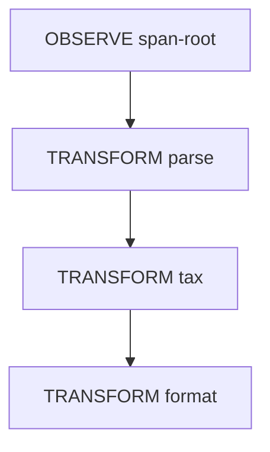

# Expert Packet A — What Is a Trace Node? (v0)

**Purpose:** One sitting (45–60 min) to validate vocabulary and schema—not bytecode, not full AOIS.

**Assurance tier of this packet:** **B** (synthetic fixtures; no production capture).

---

## 1. Claim (informal)

If orchestration behavior is recorded as a **typed span tree** with explicit **carrier vs attachment** rules, then replay and promotion claims can be stated as contracts over spans rather than over human-readable code.

See `docs/claim-template-v0.md` for the full template.

---

## 2. Artifacts on the table

| Artifact | Path |
|----------|------|
| Glossary (v0-approved span terms) | `glossary.md` § Trace & Span Ontology |
| Open decisions | `docs/open-decisions-trace-v0.md` |
| JSON Schema | `trace/schema/trace-v0.schema.json` |
| Calculator fixture | `trace/fixtures/trace-calculator-v0.json` |
| Validator | `trace/scripts/validate_trace.py` |

**Validate locally:**

```bash
python3 mechanistic-interpreter-testing/trace/scripts/validate_trace.py \
  mechanistic-interpreter-testing/trace/fixtures/trace-calculator-v0.json

python3 mechanistic-interpreter-testing/trace/scripts/freeze_certificate.py \
  mechanistic-interpreter-testing/trace/fixtures/trace-calculator-v0.json \
  --write mechanistic-interpreter-testing/trace/fixtures/certificate-calculator-v0.json
```

**Golden certificate (AW-021):** `trace/fixtures/certificate-calculator-v0.json`

---

## 3. Span kind reference (30 seconds each)

| Kind | Intent | v0 requirement |
|------|--------|----------------|
| OBSERVE | Read world | `effect_class: read` typical |
| TRANSFORM | Pure step | `effect_class: pure` required |
| COMMIT | Write world | `commit_seal` required |
| CHOOSE | Branch | `choose_ledger` required |
| DELEGATE | Sub-agent | target + capability hashes |

Lifecycle: `CAPTURED` → `CANDIDATE` → `FROZEN` → `PROMOTED` (per span).

---

## 4. Calculator fixture walkthrough



- No LLM spans—deterministic pipeline; `freeze_certificate.py` proves double-freeze / double-replay on fixture (AW-021).
- Attachment on root documents NL request as **witness only**.

---

## 5. Open decisions needing expert input

| ID | Question |
|----|----------|
| OD-001 | Five kinds vs micro-op graph—which is the Phase-1 capture target? |
| OD-004 | Can Tier-A assurance ever rely on post-hoc log inference? |
| OD-005 | When must LLM output be CHOOSE + pinned hash vs TRANSFORM? |
| OD-008 | Which attachments must be promotable to carrier for your audit regime? |

Full list: `docs/open-decisions-trace-v0.md`.

---

## 6. Falsifiers for this packet (not Trace-47 full)

1. Validator accepts a broken parent chain → schema/validator bug.
2. Two experts define "span" inconsistently → glossary gap (record term).
3. Fixture labeled TRANSFORM but requires env I/O → mis-kind; add negative fixture.

---

## 7. Questions for experts (agenda)

1. **Semantics:** What operational rules are missing for compositional replay across DELEGATE boundaries?
2. **Soundness:** Is five-kind taxonomy sufficient, or premature collapse (Winston) / too fine (Amelia at token scale)?
3. **Assurance:** Is Tier B (schema + replay hash) an honest public claim before NSHR gates exist?
4. **Schema:** Which field is wrong or missing for your regulated export class?
5. **Negative control:** Should we ship a deliberate invalid fixture in CI (broken parent id)?

---

## 8. Explicit non-goals (this meeting)

- Bytecode / opcode lowering (AW-040+)
- Trace-47 ablation battery (Packet B)
- DMN/Drools port
- Hardware data paths
- Full mechanistic interpreter (FR6) implementation

---

## 9. Suggested outcomes

| Outcome | Action |
|---------|--------|
| Approve v0 schema for calculator class | Close OD-001 partial; proceed AW-021 |
| Reject kind taxonomy | ADR + schema bump |
| Request field X | Patch schema + glossary same PR |
| Require intervention tests early | Pull forward AW-032 slice from Trace-47 |

---

## 10. Feedback capture

Record notes with date and OD-* references under `docs/expert-feedback/` (create on first review).

---

*Packet version 0.1 — hybrid path execution 2026-05-21*
